# COIT20261 – Network Routing and Switching

## Week 01 Tutorial Submission: Introduction to GNS3

| Field            | Details                                   |
| ---------------- | ----------------------------------------- |
| **Unit Code**    | COIT20261 – Network Routing and Switching |
| **Tutorial**     | Week 01 — Getting Started with GNS3       |
| **Student ID**   | 12316923                                  |
| **Submitted By** | Sunil B K                                 |
| **Date**         | Week 01                                   |

> **Objective:** In this tutorial submission, I document my step-by-step process of setting up GNS3 using the pre-configured virtual machine provided on Moodle. This includes accessing the GNS3 Web UI, creating a project, adding a Linux Host node, and configuring its IP address.

---

## Task Overview

In this week's tutorial, I was required to set up and explore the **GNS3 network simulation environment** using a pre-built virtual machine (VM) provided by CQU. GNS3 (Graphical Network Simulator-3) is an open-source tool that allows us to design and simulate network topologies without needing physical hardware like routers and switches.

The key tasks I completed in this tutorial were:

- Downloading the GNS3 OVA file from CQU Moodle and renaming it with my Student ID
- Importing and running the VM using Oracle VirtualBox
- Accessing the GNS3 Web UI through my browser
- Creating a project, adding a Linux Host node, and configuring its IP address

## Step 1 – Downloading and Renaming the GNS3 OVA File

### What I Did

I logged into **CQU Moodle** and navigated to the **COIT20261** unit page. The GNS3 OVA file was linked under the Announcements section. I accessed it through the following link:

👉 https://moodle.cqu.edu.au/mod/forum/discuss.php?d=1098875

After downloading the file, I renamed it by replacing the placeholder with my **CQU Student ID (12316923)**, following the naming convention provided in the tutorial instructions.

**Required Naming Format:**

```
GNS3-CQU-v022-[StudentID].ova
```

**My renamed file:**

```
GNS3-CQU-v022-12316923.ova
```

### Screenshot

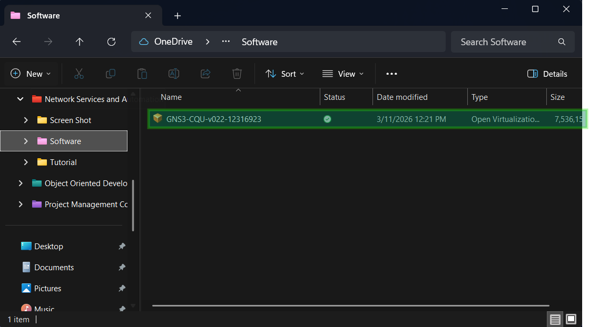
_Figure 1 – I downloaded the GNS3 OVA file from the CQU Moodle announcements page and renamed it with my Student ID._

## Step 2 – Importing the OVA File into VirtualBox

### What I Did

Before importing, I confirmed that **Oracle VirtualBox** was already installed on my computer. I then followed these steps to import the GNS3 VM:

1. I opened **VirtualBox** on my local machine.
2. I navigated to **File → Import Appliance** from the menu bar.
3. I browsed to the location of my renamed `.ova` file (`GNS3-CQU-v022-12316923.ova`) and selected it.
4. I followed the import wizard and clicked **Import** to begin the process.
5. I waited for VirtualBox to complete the extraction and registration of the VM — this took approximately 3–5 minutes on my machine.

Once the import was complete, the **GNS3 VM** appeared in the VirtualBox sidebar, ready to be started.

### Screenshot

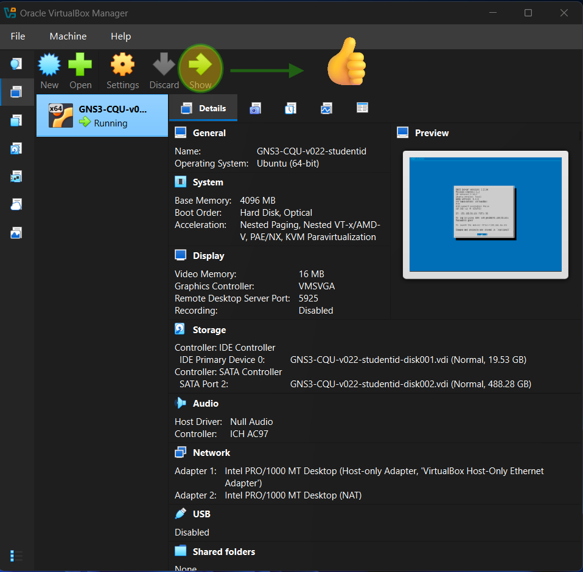
_Figure 2 – After importing the OVA file, the GNS3 VM appeared in the VirtualBox manager, ready to start._

## Step 3 – Starting the Virtual Machine

### What I Did

With the GNS3 VM successfully imported into VirtualBox, I started the machine by:

1. Selecting the **GNS3 VM** from the VirtualBox sidebar.
2. Clicking the green **Start** button at the top of the VirtualBox window.
3. Waiting approximately 30–60 seconds for the VM to fully boot.

Once booted, a terminal-style screen appeared inside the VirtualBox window showing the GNS3 system information. A dialog box also appeared which I dismissed by clicking **OK**.

> 💡 **Note:** I made sure to keep the VirtualBox window open and the VM running throughout the rest of the tutorial, as closing it would stop the GNS3 server and disconnect the Web UI.

### Screenshot

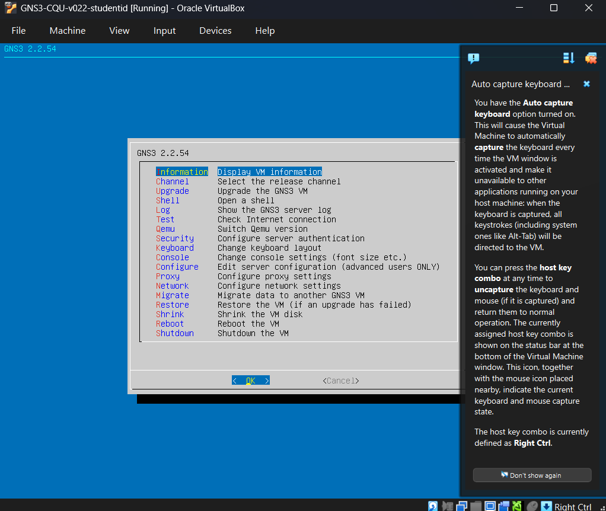
_Figure 3 – The GNS3 VM started successfully in VirtualBox, displaying the system terminal interface._

## Step 4 – Finding the GNS3 Web UI IP Address

### What I Did

After the VM finished booting, I looked at the VirtualBox terminal screen carefully. The GNS3 system displayed an **IP address** that I needed to use to access the Web UI from my browser.

The IP address shown on my VM screen was:

```
192.168.56.101
```

I wrote this IP address down before moving to the next step.

### Screenshot

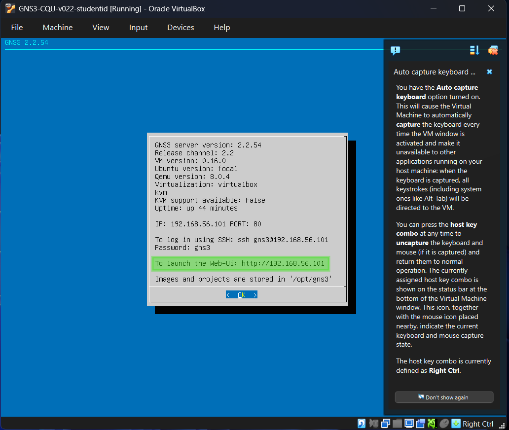
_Figure 4 – The GNS3 VM terminal displayed the IP address (192.168.56.101) that I used to access the Web UI._

## Step 5 – Accessing the GNS3 Web Dashboard

### What I Did

I opened my web browser (Google Chrome) and typed the following URL into the address bar using the IP address I noted from the VM:

```
http://192.168.56.101
```

After pressing `Enter`, the **GNS3 Web Dashboard** loaded successfully. This is the main interface where I will manage all my GNS3 projects and network simulations.

### Screenshots

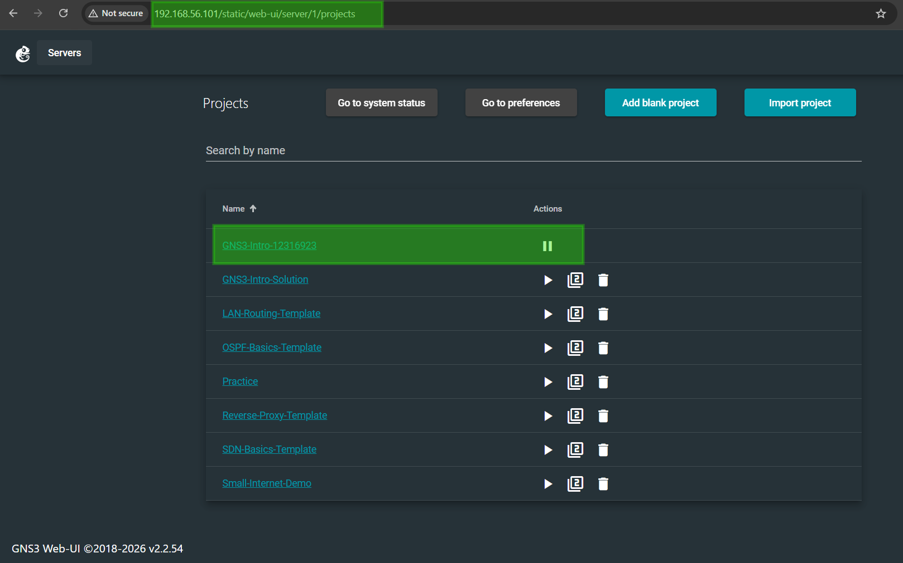
_Figure 5a – The GNS3 Web Dashboard loaded successfully in my browser after entering the VM's IP address._

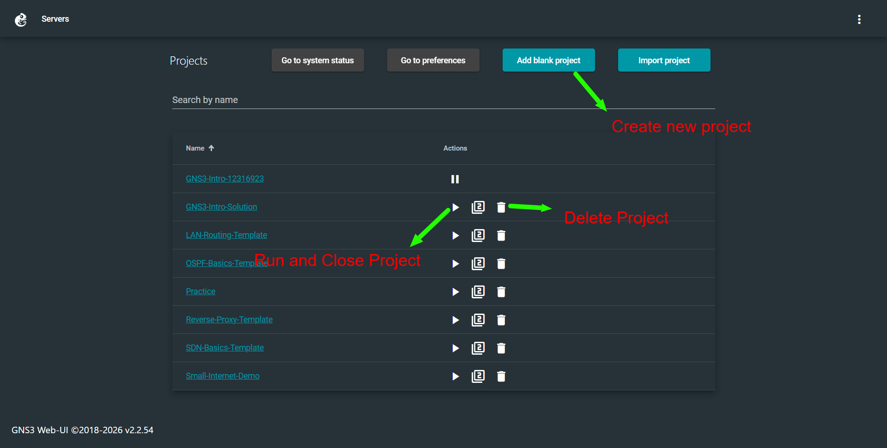
_Figure 5b – An overview of the GNS3 Web Dashboard showing the main navigation and project options._

## Step 6 – Creating a New Project

### What I Did

When the GNS3 Web Dashboard loaded, I was prompted to create a new project. I followed these steps:

1. I clicked the **"Add blank project"** button displayed at the top of the dashboard.
2. In the project name field, I entered my **Student ID (12316923)** as the project name, as recommended by my tutor so my work can be easily identified.
3. I clicked **"Add project"** to confirm and create the project.

**My project name:**

```
12316923
```

### Screenshots

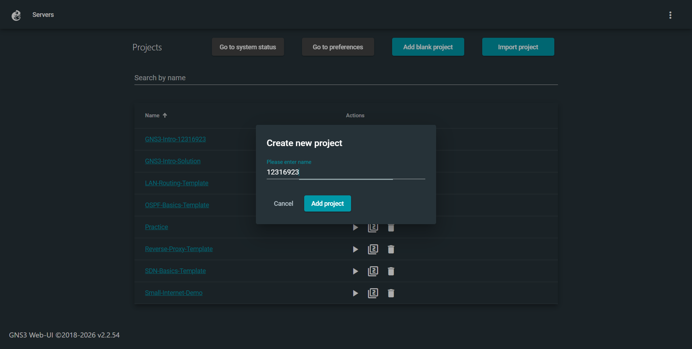
_Figure 6a – I created a new project and named it with my Student ID (12316923) as instructed._

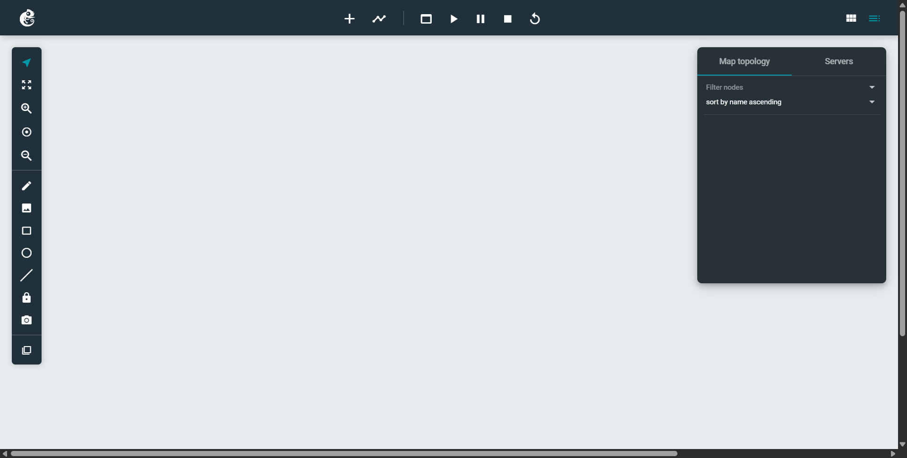
_Figure 6b – The blank project canvas opened, ready for me to start adding network nodes._

## Step 7 – Adding a Linux Host Node

### What I Did

With the blank project canvas open, I added a **Linux Host** node, which simulates a basic end-user Linux device on the network.

1. I clicked the **`+` (plus) icon** on the left-side toolbar to open the node browser panel.

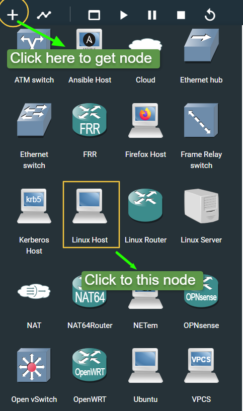
_Figure 7 – I clicked the + icon on the left toolbar to open the node browser and search for available node types._

2. In the node browser, I searched for **"Linux"** and located the **Linux Host** node.
3. I clicked on the **Linux Host** node and then **clicked on the canvas** to place it.
4. The node appeared on the canvas with a default label (e.g., `Linux-1`).

## Step 8 – Starting the Project and Exploring Node Properties

### What I Did

#### Starting the Project

Once the Linux Host node was placed on the canvas, I started the project by clicking the **Play (▶) button** in the top toolbar. I waited a few seconds while the node initialised and its status indicator turned **green**, confirming it was running.

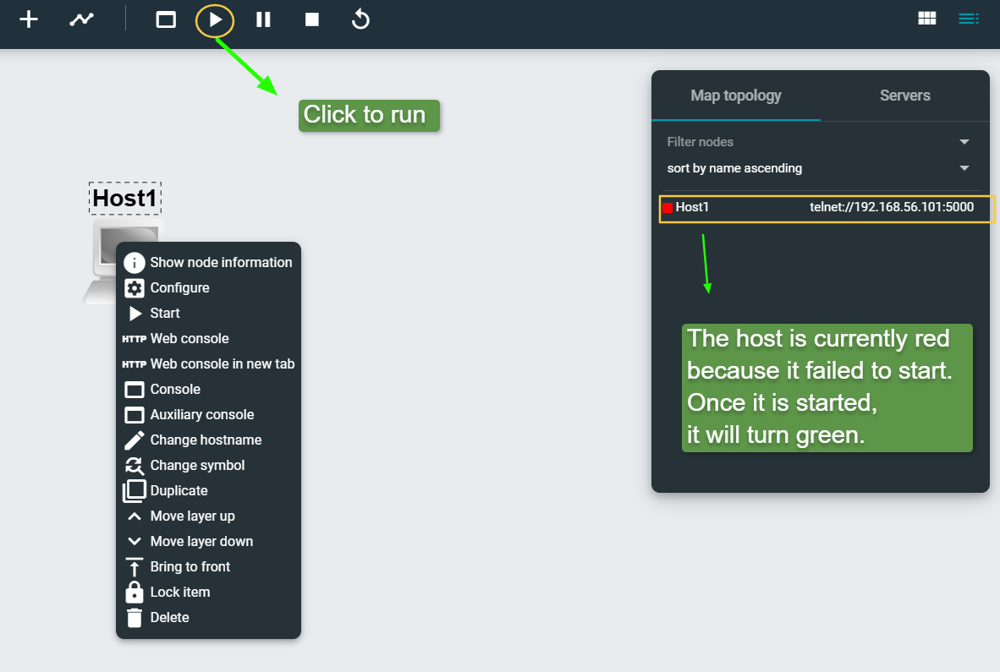
_Figure 8a – The Linux Host node was successfully added and started. The green indicator confirms it is running._

#### Adding My Student Information as a Label

As part of the submission requirement, I added a **text annotation** on the project canvas to display my identifying information. I right-clicked on an empty area of the canvas and used the annotation tool to add a label containing:

- **Student Name:** Sunil B K
- **Student ID:** 12316923
- **Unit Code:** COIT20261

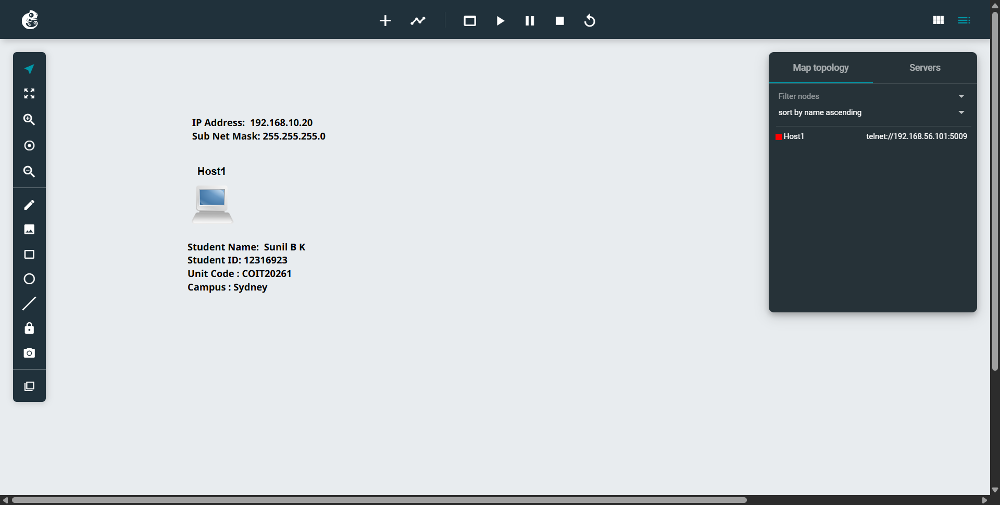
_Figure 8b – I added my student information as a text label on the canvas, as required for the submission._

## Step 9 – Opening the Web Console and Checking the IP Address

### What I Did

To access the command line of the Linux Host node:

1. I **right-clicked** on the Linux Host node on the canvas.
2. I selected **"Web Console in New Tab"** from the context menu.
3. A new browser tab opened showing a terminal interface connected to the Linux Host node.

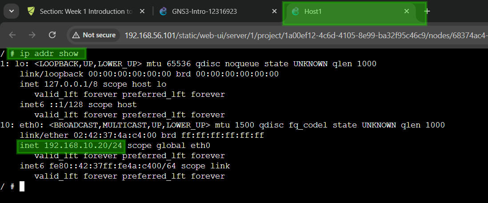
_Figure 9 – The Web Console opened in a new browser tab, giving me direct command-line access to the Linux Host node._

### Checking the IP Address

In the terminal, I typed the following command and pressed `Enter`:

```bash
ip addr show
```

This command listed all the **network interfaces** and their current IP address assignments on the node. I noted down the IP address shown next to the `eth0` interface, as I would need it when configuring the node in the next step.

## Step 10 – Configuring the Node's IP Address

### What I Did

With the IP address confirmed from the console, I proceeded to configure the node with a static IP address using the GNS3 configuration panel.

#### Opening the Configuration Panel

1. I **right-clicked** on the Linux Host node on the canvas.
2. I selected **"Configure"** from the context menu.
3. The node configuration interface opened in the browser.

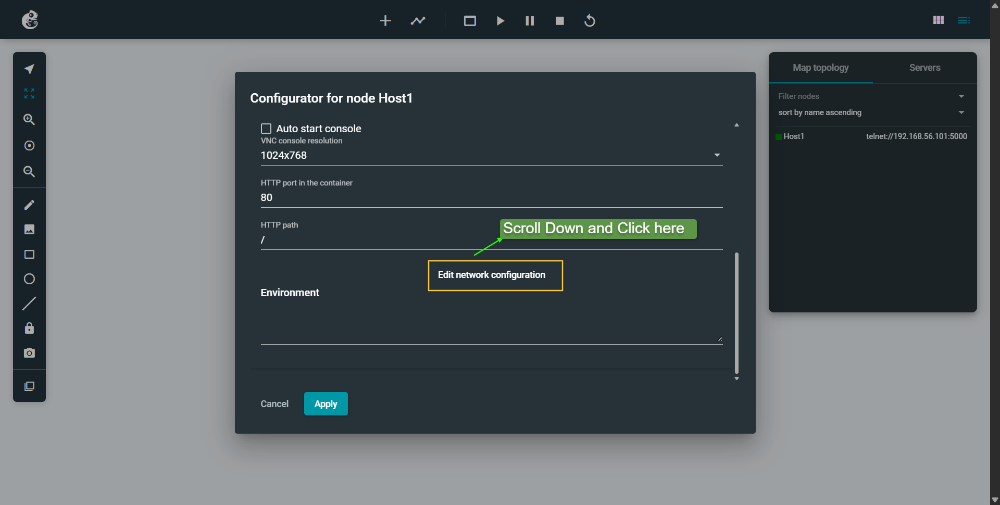
_Figure 10a – The configuration panel for the Linux Host node, showing the network interface settings file._

4. I clicked **Save** to apply the configuration.

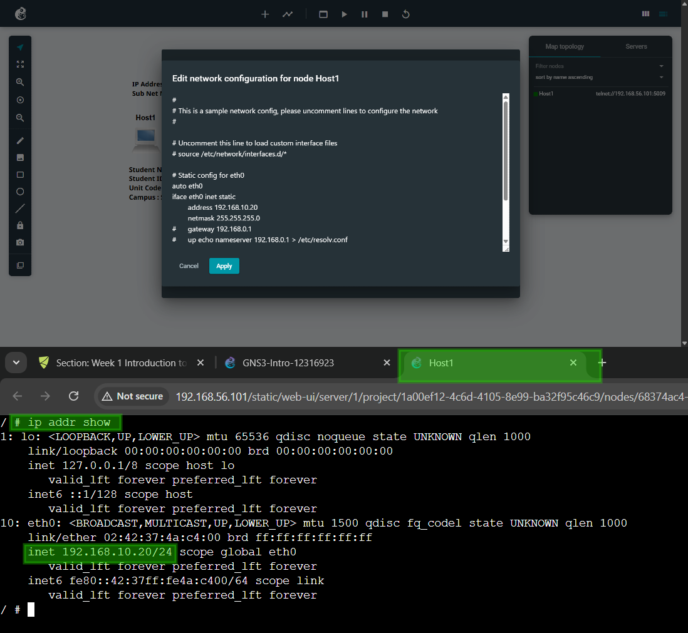
_Figure 10b – The configuration file updated with the correct IP address, uncommented and saved._

#### Verifying the Configuration

After saving, I restarted the node (right-click → Stop → Start) and reopened the Web Console. I ran `ip addr show` again to confirm the new static IP address had been applied correctly to the `eth0` interface.

### What I Learned

I learned the difference between **dynamic (DHCP)** and **static IP** addressing. When the configuration lines were commented out, the node would attempt to obtain an IP address automatically via DHCP. By uncommenting the lines and specifying a static address, I am manually assigning a fixed IP address to the node — this is common practice for servers and network infrastructure devices where a predictable, permanent address is required.

I also learned the structure of the Linux network interface configuration file (`/etc/network/interfaces`), which uses keywords like `auto` (bring up the interface automatically at boot) and `iface` (define the interface settings). Understanding this file format will be important in future tutorials when I configure more complex network setups.

> [!NOTE]
> **📁 Source Files – Week 01 Tutorial**
>
> - **Source File of Week 01 Tutorial:** [Click here to view →](./files/week01/GNS3-Intro-12316923.gns3project)

---

## Reflection

This was my first time using GNS3, and I found the setup process straightforward once I understood that the GNS3 environment runs entirely inside a VirtualBox VM. Initially I was unsure why we were using a browser instead of the GNS3 desktop application, but I now understand that the VM hosts a GNS3 server and the browser is simply the client interface connecting to it.

The most challenging part for me was understanding the IP address configuration file — particularly the importance of removing the comment symbols (`#`) to activate the settings. I also found it useful to run `ip addr show` before and after the configuration to visually confirm the change had taken effect.

These foundational skills — setting up a virtual environment, accessing a web-based management console, and configuring network interfaces — will be directly applied in upcoming tutorials as I begin working with routers, switches, and routing protocols in more complex network topologies.

> 📘 **References:**
>
> - CQU Moodle – COIT20261 Unit Page of Week 01: https://moodle.cqu.edu.au/course/section.php?id=874607
