# COIT20261 – Network Routing and Switching

## Week 02 Tutorial Submission: Static IP Addressing & Network Connectivity

| Field            | Details                                                   |
| ---------------- | --------------------------------------------------------- |
| **Unit Code**    | COIT20261 – Network Routing and Switching                 |
| **Tutorial**     | Week 02 — Setting Static IP Addresses & Testing with Ping |
| **Student ID**   | 12316923                                                  |
| **Student Name** | Sunil B K                                                 |
| **Date**         | Week 02                                                   |

> **Objective:** This week I learned two methods to assign static IP addresses to Linux Host nodes in GNS3 — via the GNS3 GUI Configure menu, and via the `/etc/network/interfaces` file edited in the nano terminal. I also tested network connectivity using the `ping` command.

---

## Task Overview

The network I used: **`192.168.10.0/24`**

| Host  | IP Address      | Netmask         | Configuration Method                           |
| ----- | --------------- | --------------- | ---------------------------------------------- |
| Host1 | `192.168.10.20` | `255.255.255.0` | GNS3 GUI – Configure menu                      |
| Host2 | `192.168.10.21` | `255.255.255.0` | GNS3 GUI – Configure menu                      |
| Host3 | `192.168.10.22` | `255.255.255.0` | `nano /etc/network/interfaces` via Web Console |
| Host4 | `192.168.10.23` | `255.255.255.0` | `nano /etc/network/interfaces` via Web Console |

## Task 1 – Setting Static IP Addresses

### Step 1 – Creating the Project and Network Topology

I created a new project named `Setting-IP-12316923`, added 4 Linux Host nodes and 1 Ethernet Switch, then connected each host to the switch in a star topology.

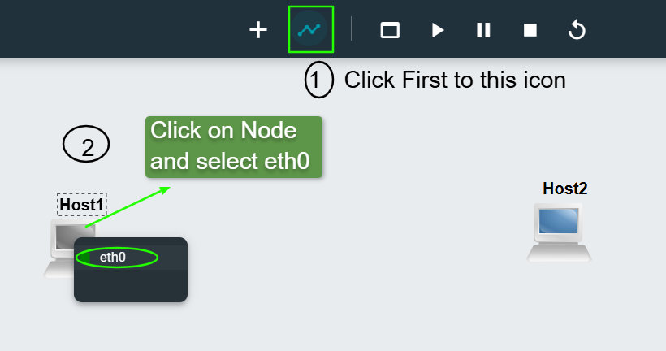
_Figure 1a – Adding Linux Host nodes and Ethernet Switch from the node browser._

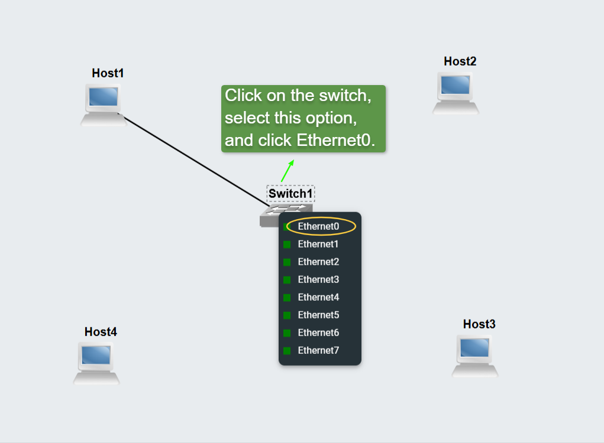
_Figure 1b – Drawing links between each host and the switch._

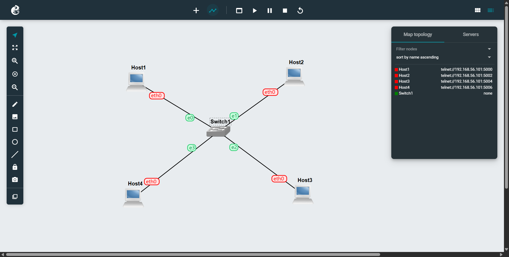
_Figure 1c – Completed star topology: all four hosts connected to Switch1._

### Step 2 – Configuring Host1 & Host2 via GNS3 GUI

I right-clicked each node → **Configure** → edited the static block → clicked **Apply**.

**Configuration applied to Host1:**

```
auto eth0
iface eth0 inet static
    address 192.168.10.20
    netmask 255.255.255.0
```

**Configuration applied to Host2:**

```
auto eth0
iface eth0 inet static
    address 192.168.10.21
    netmask 255.255.255.0
```

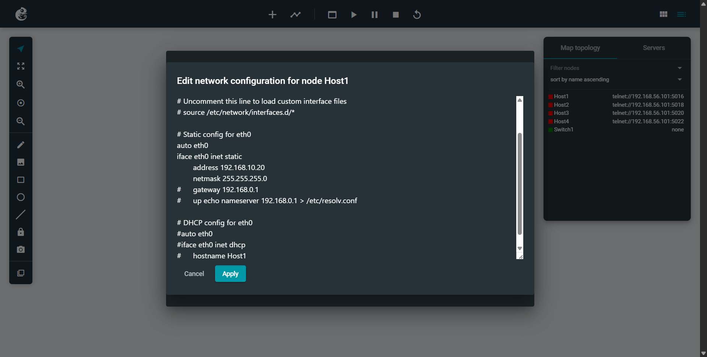
_Figure 2a – Host1 set to `192.168.10.20/24` via the GNS3 Configure menu._


_Figure 2b – Host2 set to `192.168.10.21/24` via the GNS3 Configure menu._

### Step 3 – Configuring Host3 & Host4 via nano Terminal

For Host3 and Host4, I opened **Web Console in New Tab** and edited the interfaces file directly:

```bash
nano /etc/network/interfaces
```

Set the address, saved with **`Ctrl+O` → Enter**, exited with **`Ctrl+X`**, then reloaded:

```bash
ifdown eth0
ifup eth0
```

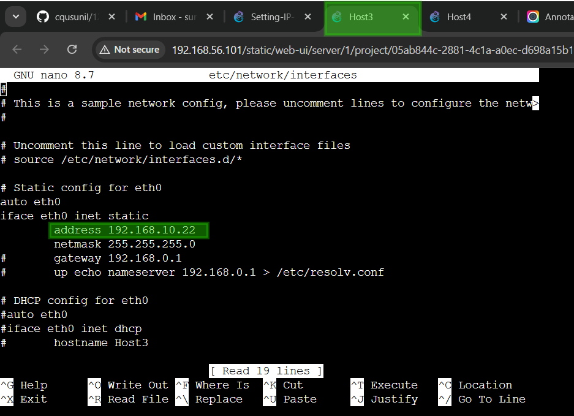
_Figure 3 – Host3 interfaces file edited in nano with `address 192.168.10.22`._

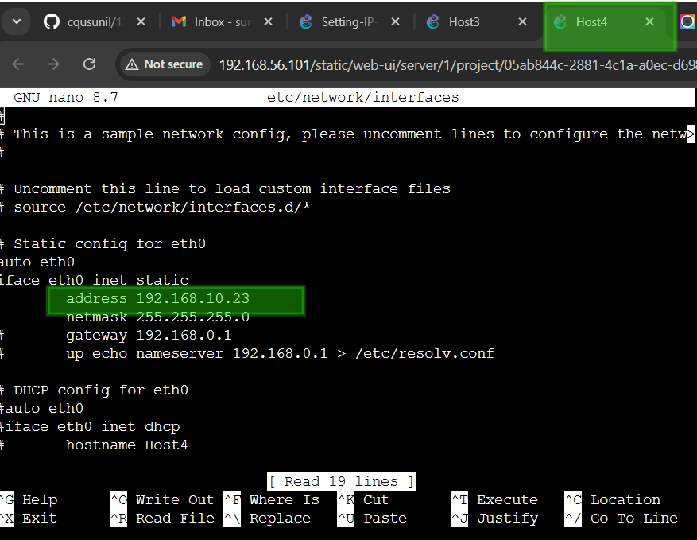
_Figure 4 – Host4 interfaces file edited in nano with `address 192.168.10.23`._

#### nano Quick Reference

| Action        | Shortcut                |
| ------------- | ----------------------- |
| Save the file | `Ctrl + O` then `Enter` |
| Exit nano     | `Ctrl + X`              |
| Cut a line    | `Ctrl + K`              |
| Paste a line  | `Ctrl + U`              |

### Step 4 – Verifying All IP Addresses

After starting all nodes, I ran `ip addr show` on each host to confirm the addresses were active.

```bash
ip addr show
```

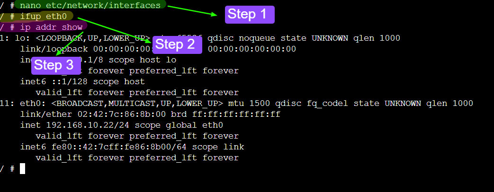

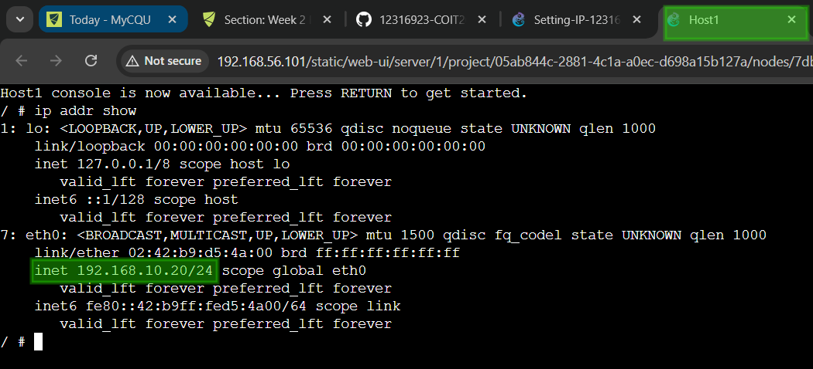
_Figure 5b – Host1 confirmed: `192.168.10.20/24`_

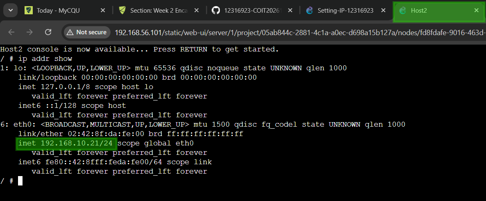
_Figure 5c – Host2 confirmed: `192.168.10.21/24`_

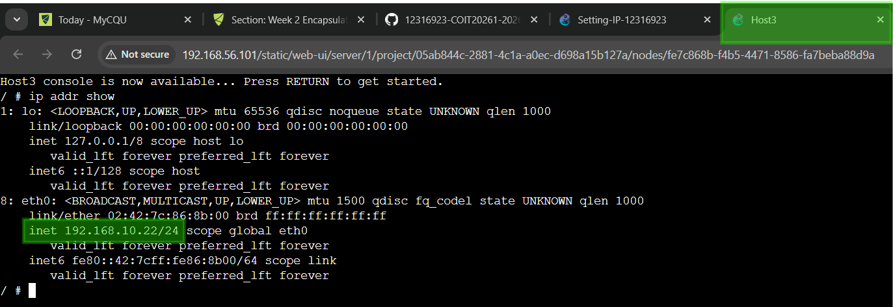
_Figure 5d – Host3 confirmed: `192.168.10.22/24`_

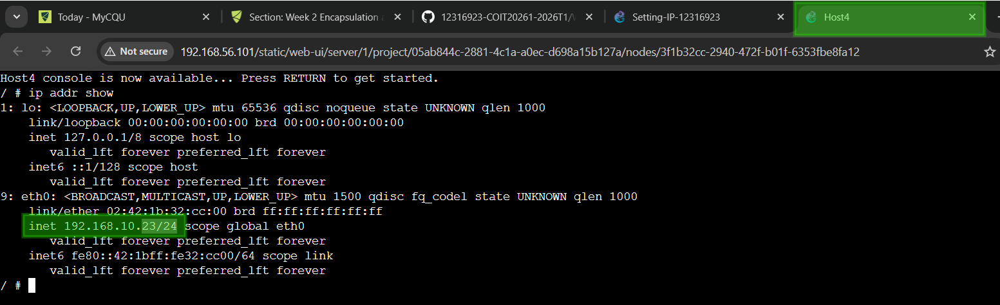
_Figure 5e – Host4 confirmed: `192.168.10.23/24`_

---

## Task 2 – Testing Network Connectivity with Ping

All three ping tests were run from the **Host1 console** (`192.168.10.20`).

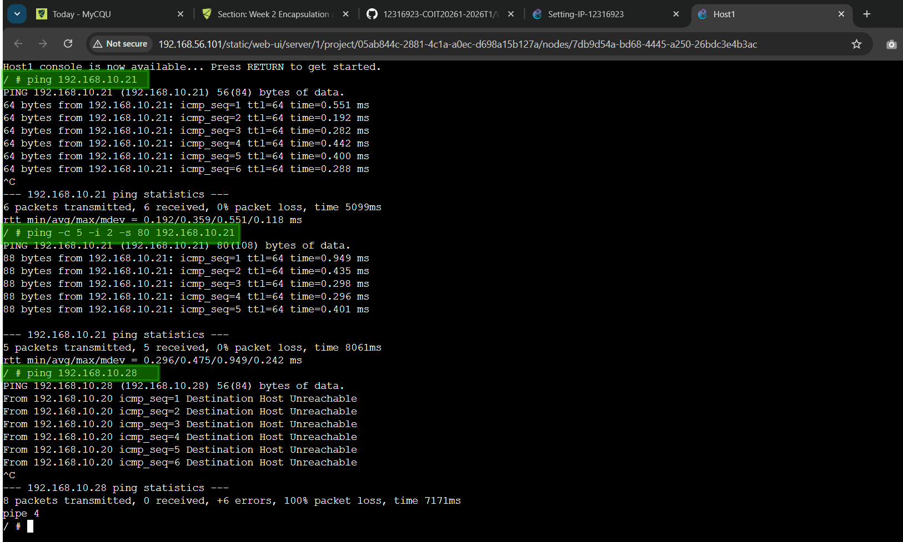
_Figure 6 – All three ping tests run from Host1 console: basic ping, custom options ping, and unreachable host ping._

### Test 1 – Basic Ping (no options)

```bash
ping 192.168.10.21
```

**Actual output from my console:**

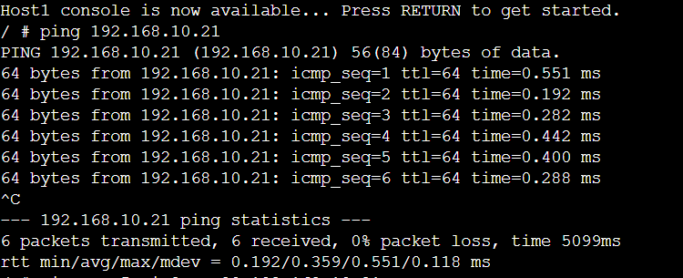

**Result:** 6/6 packets received, **0% packet loss** — Host2 is fully reachable from Host1.

#### Testing ping from host2 to host1

## 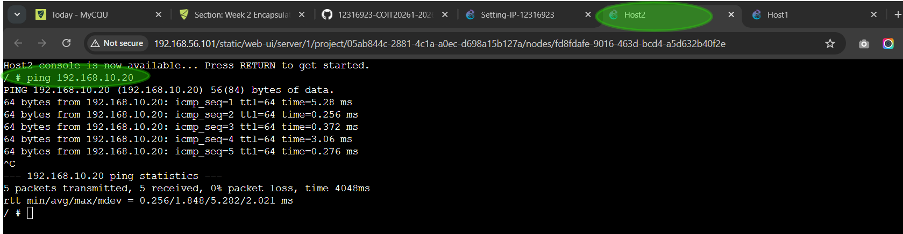

### Test 2 – Ping with Custom Options

```bash
ping -c 5 -i 2 -s 80 192.168.10.21
```

| Option  | Value    | Meaning                                                     |
| ------- | -------- | ----------------------------------------------------------- |
| `-c 5`  | 5        | Send exactly 5 packets then stop                            |
| `-i 2`  | 2 sec    | Wait 2 seconds between each packet                          |
| `-s 80` | 80 bytes | Set data payload to 80 bytes (total 108 bytes with headers) |

**Actual output from my console:**

## 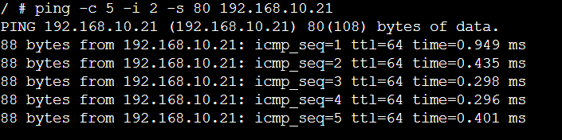

**Result:** 5/5 packets received, stopped automatically after count was reached. The larger packet size (80 bytes) slightly increased the average RTT from `0.359 ms` to `0.475 ms`.

### Test 3 – Ping to a Non-Existent Host

```bash
ping 192.168.10.28
```

**Actual output from my console:**

## 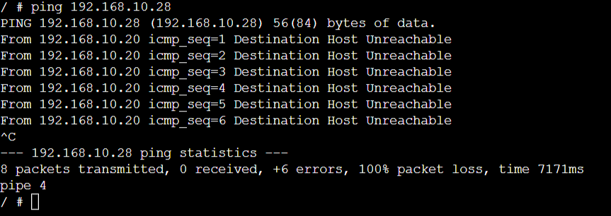

**Result:** 0 replies, **100% packet loss** — no device exists at `192.168.10.28`. The error message **"Destination Host Unreachable"** means Host1 sent an ARP broadcast asking "who has `192.168.10.28`?" and received no response — confirming the address is unassigned on this network.

> [!NOTE]
> **📁 Source Files – Week 02 Tutorial**
>
> - **Source File of Week 02 Tutorial:** [Click here to view →](./files/week02/Setting-IP-12316923.gns3project)

---

## Reflection

This week was a significant step forward in my understanding of Linux networking and how configuration methods differ from each other.

**On IP configuration methods:** I used the GNS3 GUI for Host1 and Host2, and the `nano` terminal editor for Host3 and Host4. The key insight is that both methods edit the same underlying file — `/etc/network/interfaces` — but the timing of when that configuration takes effect is different. When configured through the GUI before starting a node, the settings are applied automatically at boot. When I edited the file in the terminal on an already-running node, I had to manually run `ifdown eth0` and `ifup eth0` to apply the changes. This taught me that in Linux, **changing a configuration file does not automatically change the running system state** — you always need to trigger the reload.

**On persistence:** Both the GUI and nano methods write to the interfaces file, so both are permanent and survive a restart. This is important for servers and infrastructure devices where the IP must remain the same after a reboot.

**On ping:** The three tests showed me very clearly how ping behaves in different situations. The basic ping confirmed connectivity with consistent sub-millisecond RTTs — expected in a local simulated LAN. The custom options test (`-c 5 -i 2 -s 80`) showed me that a larger packet size slightly increases RTT (from an average of `0.359 ms` up to `0.475 ms`), and that `-c` is very useful so I do not have to manually press `Ctrl+C` every time. The most valuable test was the unreachable host ping — seeing **"Destination Host Unreachable"** rather than just a timeout taught me that the error originates from my own machine's ARP failure, not from a remote router. This is a subtle but important distinction in real-world network troubleshooting.

**Overall:** These foundational skills — configuring static IPs and verifying connectivity with ping — are the building blocks for everything that follows in this unit, including routing, subnetting, and inter-VLAN communication.

> 📘 **References:**
>
> - CQU Moodle COIT20261: https://moodle.cqu.edu.au/course/section.php?id=874608
