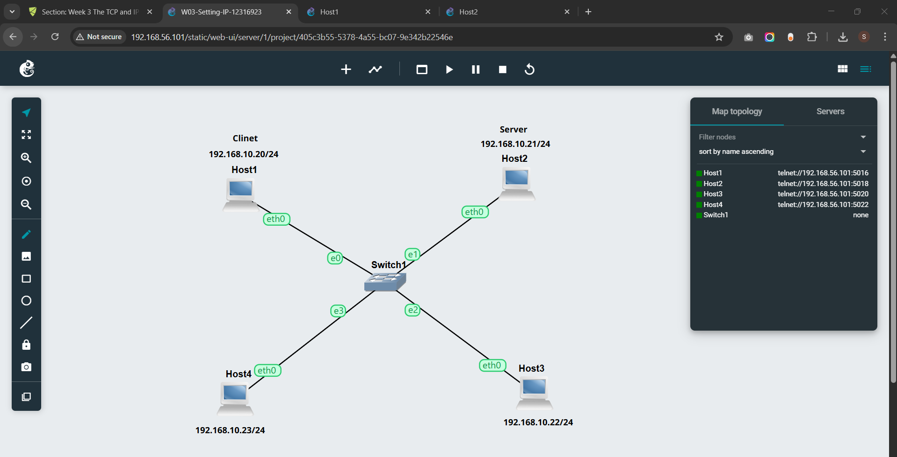
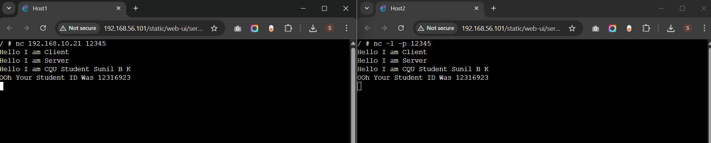
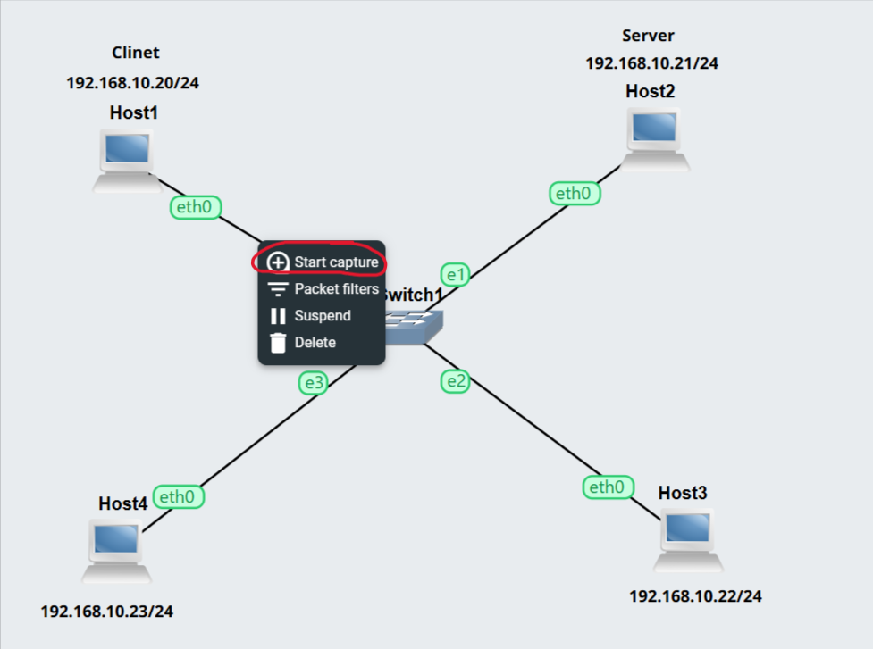
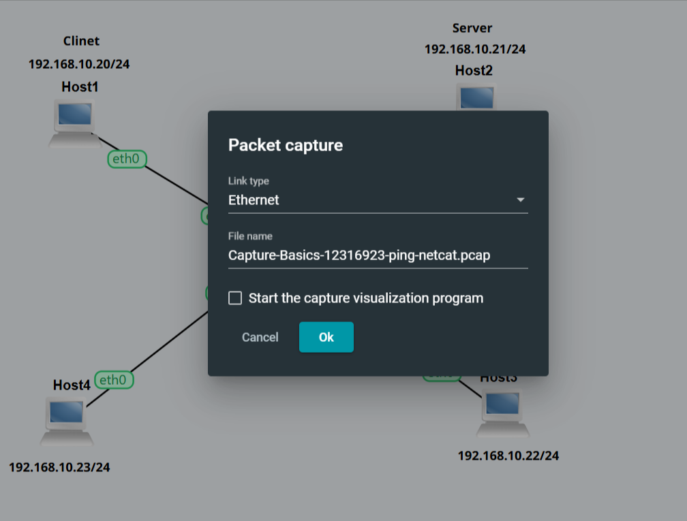
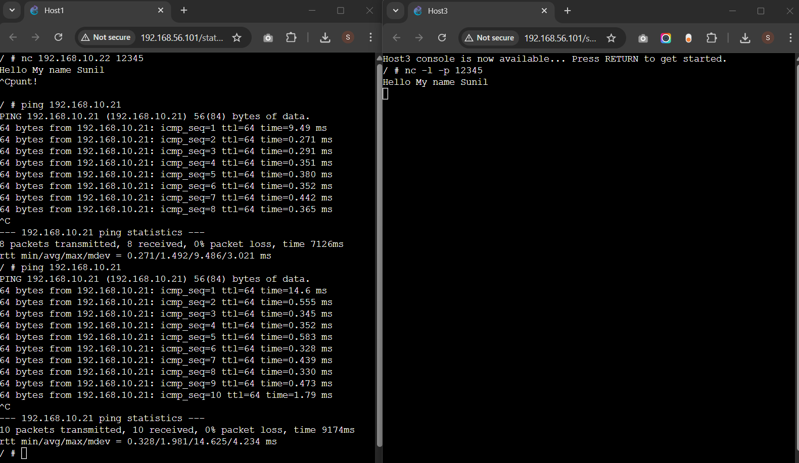
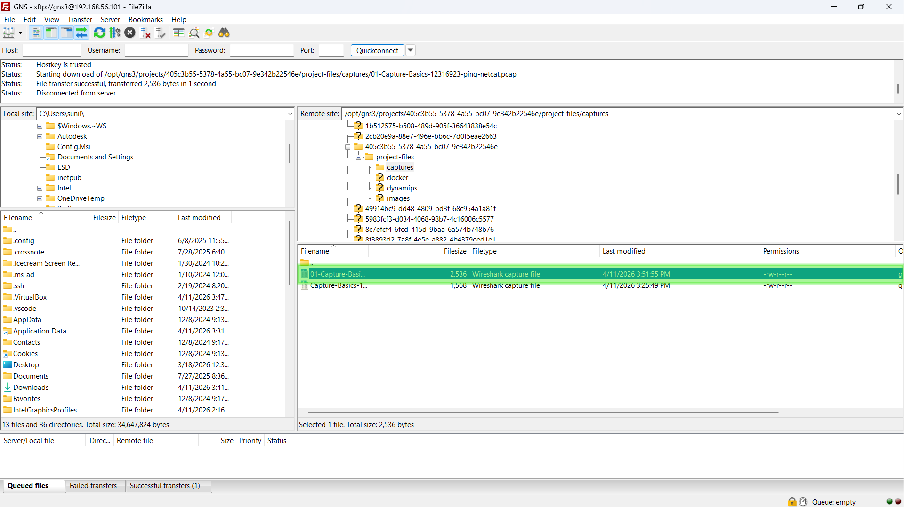
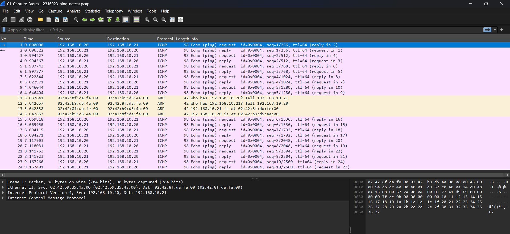

# COIT20261 – Network Routing and Switching

## Week 03 Tutorial Submission: Netcat Communications & Packet Capturing

| Field            | Details                                             |
| ---------------- | --------------------------------------------------- |
| **Unit Code**    | COIT20261 – Network Routing and Switching           |
| **Tutorial**     | Week 03 — Netcat Communications & Capturing Packets |
| **Student ID**   | 12316923                                            |
| **Student Name** | Sunil B K                                           |
| **Date**         | Week 03                                             |

> **Objective:** This week I learned how to use **Netcat (`nc`)** to establish a simple client-server communication between two Linux hosts in GNS3. Unlike `ping` which tests network-level connectivity via ICMP, Netcat tests application-level communication via TCP — making it a more realistic test of whether two devices can actually exchange data across a network.

---

## Task Overview

I reused the existing project from Week 02 and renamed it `W03-Setting-IP-12316923`. All four hosts retained their IP addresses from last week.

| Host  | Role       | IP Address         |
| ----- | ---------- | ------------------ |
| Host1 | **Client** | `192.168.10.20/24` |
| Host2 | **Server** | `192.168.10.21/24` |
| Host3 | —          | `192.168.10.22/24` |
| Host4 | —          | `192.168.10.23/24` |

---

## Task 1 – Simple Application Communications with Netcat

### Step 1 – Network Topology

I opened the `W03-Setting-IP-12316923` project in GNS3. All four hosts were already configured with static IP addresses and connected to Switch1 in a star topology. All nodes showed a green indicator confirming they were running.


_Figure 1 – The GNS3 network topology for Week 03. Host1 (Client, `192.168.10.20/24`) and Host2 (Server, `192.168.10.21/24`) are used for the Netcat task._

### Step 2 – Starting the Netcat Server on Host2

I opened the **Web Console in New Tab** for **Host2**, which I designated as the **server**. I started Netcat in listening (server) mode on port `12345`:

```bash
nc -l -p 12345
```

| Flag       | Meaning                                                                      |
| ---------- | ---------------------------------------------------------------------------- |
| `-l`       | Listen mode — puts Netcat in server mode, waiting for an incoming connection |
| `-p 12345` | The port number to listen on                                                 |

After running this command, the terminal showed a blank line — this means the server is ready and waiting for a client to connect.

### Step 3 – Connecting the Netcat Client from Host1

I opened the **Web Console in New Tab** for **Host1**, which I designated as the **client**. I connected to the server using Host2's IP address and the same port:

```bash
nc 192.168.10.21 12345
```

| Argument        | Meaning                                    |
| --------------- | ------------------------------------------ |
| `192.168.10.21` | The IP address of the server (Host2)       |
| `12345`         | The port number the server is listening on |

After running this command, both the client and server terminals showed a blank line — confirming the TCP connection was established successfully.

### Step 4 – Exchanging Messages Between Client and Server

With the connection established, I typed messages on both sides. Messages typed on the client appeared on the server, and messages typed on the server appeared on the client — demonstrating **bidirectional TCP communication**.

**Messages sent from Client (Host1) → received on Server (Host2):**

```
Hello I am Client
Hello I am CQU Student Sunil B K
```

**Messages sent from Server (Host2) → received on Client (Host1):**

```
Hello I am Server
OOh Your Student ID Was 12316923
```

I stopped Netcat on both sides by pressing **`Ctrl + D`**.

### Step 5 – Screenshot of Client and Server


_Figure 2 – Both Host1 (Client, left) and Host2 (Server, right) consoles shown side by side. The client connected with `nc 192.168.10.21 12345` and the server listened with `nc -l -p 12345`. Messages were exchanged successfully in both directions including name and Student ID._

---

## Task 2 – Capturing Packets

### Step 1 – Starting a Packet Capture on the Link

In GNS3, I right-clicked on the link connecting **Host1 to Switch1** and selected **Start capture**. In the dialog that appeared I selected **Ethernet** as the link type and named the file:




```
Capture-Basics-12316923-ping-netcat.pcap
```

I clicked **OK** to begin recording all packets travelling across that link.

### Step 2 – Ping from Host1 to Host2 (3 packets)

With the capture running, I opened the **Host1 Web Console** and ran a ping to Host2 limited to 3 requests:

```bash
ping -c 3 192.168.10.21
```

All packets were received with **0% packet loss**, confirming connectivity between Host1 and Host2. These ICMP packets are now recorded in the capture file.

### Step 3 – Send Name via Netcat from Host1 to Host3

While the capture was still running, I set up a Netcat session between **Host1 (client)** and **Host3 (server)** to capture TCP traffic as well.

**On Host3** (server — `192.168.10.22`), I started Netcat listening on port `12345`:

```bash
nc -l -p 12345
```

**On Host1** (client — `192.168.10.20`), I connected to Host3:

```bash
nc 192.168.10.22 12345
```

I then typed my name and sent it from client to server:

```
Hello My name Sunil
```

The message appeared immediately on Host3's console, confirming the TCP connection and data transfer were successful. I stopped Netcat on both sides with **`Ctrl + C`**.

#### Screenshot


_Figure 3 – Host1 (left) shows the Netcat client command `nc 192.168.10.22 12345` and two ping sessions to Host2. Host3 (right) shows the server `nc -l -p 12345` receiving the message "Hello My name Sunil". All traffic during this session was captured on the Host1–Switch1 link._

### Step 4 – Stopping the Capture and Transferring the File

Once both the ping and Netcat tasks were complete, I:

1. Right-clicked the **Host1 → Switch1** link in GNS3
2. Selected **Stop capture** to end the recording

The `.pcap` file was saved on the GNS3 server at:

```
/opt/gns3/projects/<project-id>/project-files/captures/
```

#### Output File

The capture file has been saved and submitted as:

```
01-Capture-Basics-12316923-ping-netcat.pcap
```

This file contains both the **ICMP ping packets** (from the ping to Host2) and the **TCP packets** (from the Netcat session to Host3), all recorded on the Host1–Switch1 link.





> [!NOTE]
> **📁 Source Files – Week 03 Tutorial**
>
> - **Source File of Week 03 Tutorial:** [Click here to view →](./files/week03/01-Capture-Basics-12316923-ping-netcat.pcap)
> - **PCAP File:** [Click here to view →](./files/week03/01-Capture-Basics-12316923-ping-netcat.pcap)

## Reflection

This week combined two important networking skills — **application-layer communication with Netcat** and **packet-level traffic capture** — giving me a much deeper picture of how data actually moves through a network.

**On Task 1 (Netcat):** The client-server model became very clear through hands-on practice. The server must always be started first because the client needs something to connect to. If the order is reversed, the connection fails immediately. This is how every real networked application works — web servers, SSH daemons, database servers — they all listen before clients connect.

**On Task 2 (Packet Capture):** Capturing on the link between Host1 and Switch1 let me record everything leaving Host1 — both the ICMP packets from ping and the TCP packets from Netcat. This showed me that different protocols produce different packet types at the capture level, even though both look like normal "communication" at the user level. Ping generates ICMP Echo Request/Reply pairs, while Netcat generates a TCP handshake (SYN, SYN-ACK, ACK) followed by data segments and a FIN to close the connection.

**On transferring the file:** Using FileZilla over SFTP to pull the `.pcap` file from the GNS3 VM taught me how to access files on a remote Linux server — a practical skill used constantly in real network administration and security work.

**Overall:** These two tasks together demonstrate that understanding a network requires visibility at multiple layers — you can test connectivity with ping (ICMP), verify application communication with Netcat (TCP), and then confirm exactly what happened at the packet level with a capture tool like Wireshark. Each tool adds a different layer of understanding.

---

> 📘 **References:**

- CQU Moodle COIT20261: https://moodle.cqu.edu.au/course/section.php?id=874609
