# COIT20261 – Network Routing and Switching

## Week 04 Tutorial Submission: View Routing Tables & Dynamic Routing with OSPF

| Field            | Details                                             |
| ---------------- | --------------------------------------------------- |
| **Unit Code**    | COIT20261 – Network Routing and Switching           |
| **Tutorial**     | Week 04 — View Routing Tables, IP Forwarding & OSPF |
| **Student ID**   | 12316923                                            |
| **Student Name** | Sunil B K                                           |
| **Date**         | Week 04                                             |

> **Objective:** This week I created a two-subnet network topology using a Linux Router in GNS3, configured IP forwarding on the router, set default gateways on all hosts, viewed the routing tables of every device, and tested cross-subnet connectivity using `ping`. I also explored dynamic routing with OSPF using FRRouting.

## Task Overview

I created a new project named `View-Routes-12316923`. This week introduced a **router** to connect two separate subnets — a significant step beyond previous weeks where all hosts were on a single LAN.

| Device  | Interface | IP Address         | Gateway        | Forwarding        |
| ------- | --------- | ------------------ | -------------- | ----------------- |
| Host1   | eth0      | `192.168.10.10/24` | `192.168.10.1` | Disabled (`0`)    |
| Host2   | eth0      | `192.168.10.11/24` | `192.168.10.1` | Disabled (`0`)    |
| Router1 | eth0      | `192.168.10.1/24`  | —              | **Enabled (`1`)** |
| Router1 | eth1      | `192.168.20.1/24`  | —              | **Enabled (`1`)** |
| Host3   | eth0      | `192.168.20.10/24` | `192.168.20.1` | Disabled (`0`)    |

| Network       | Subnet            | Devices                               |
| ------------- | ----------------- | ------------------------------------- |
| **Network 1** | `192.168.10.0/24` | Host1, Host2, Router1 (eth0), Switch1 |
| **Network 2** | `192.168.20.0/24` | Host3, Router1 (eth1)                 |

## Task 1 – View Routing Tables

### Step 1 – Network Topology

I created the project and built the following topology:

- **Host1** and **Host2** connected to **Switch1** (Network 1)
- **Switch1** connected to **Router1 eth0**
- **Router1 eth1** connected directly to **Host3** (Network 2)

The router acts as the bridge between the two subnets. Without it, hosts on Network 1 cannot reach Host3 on Network 2.

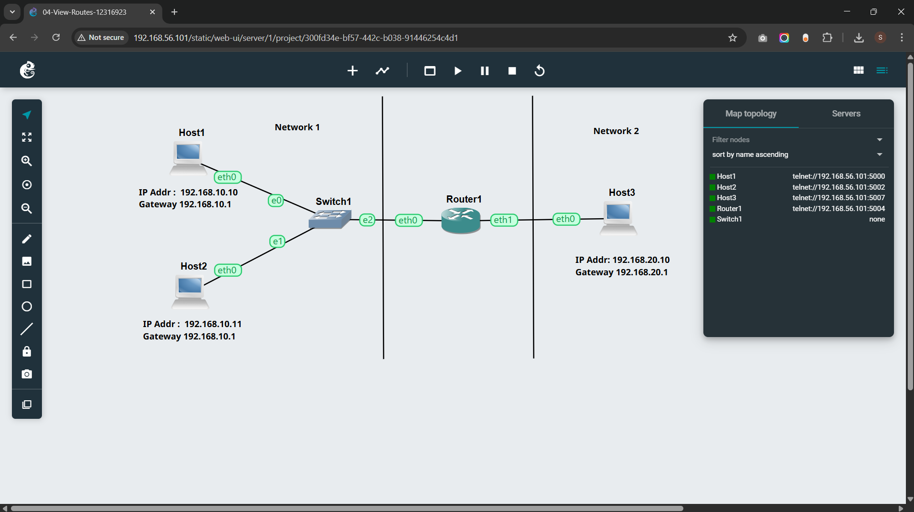
_Figure 1 – Network topology: Host1 (`192.168.10.10`) and Host2 (`192.168.10.11`) on Network 1 connected via Switch1 to Router1, which connects to Host3 (`192.168.20.10`) on Network 2._

### Step 2 – Configuring Host1

I right-clicked **Host1 → Configure** and set the following:

> The `gateway 192.168.10.1` line tells Host1 to send all traffic destined for other subnets to Router1. The `ip_forward=0` disables packet forwarding since Host1 is an end host, not a router.

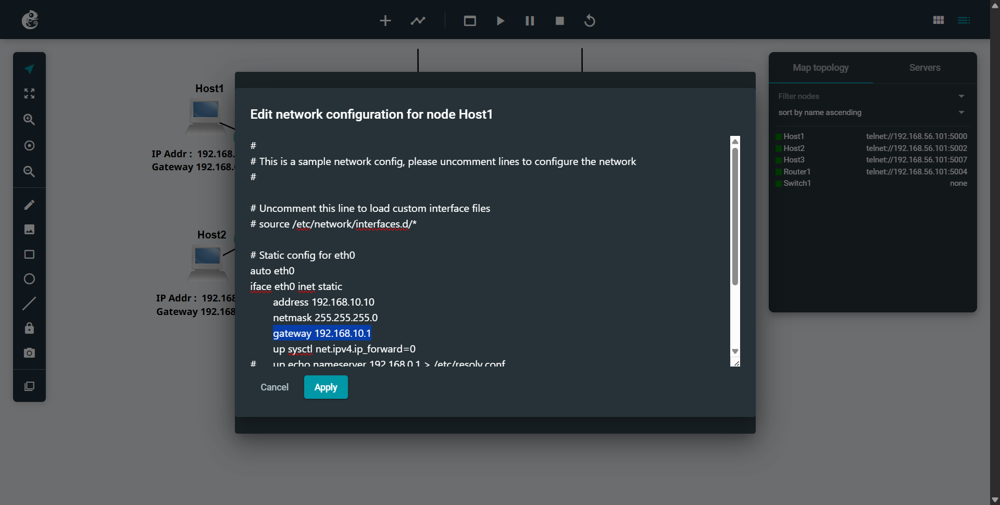
_Figure 2 – Host1 configured with IP `192.168.10.10/24`, gateway `192.168.10.1`, and forwarding disabled._

### Step 3 – Configuring Host2

I right-clicked **Host2 → Configure** and set:

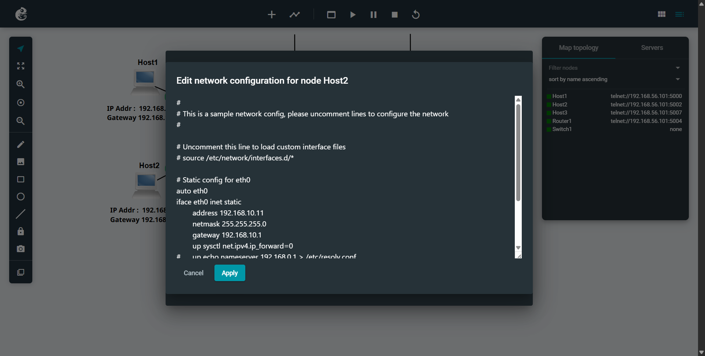
_Figure 3 – Host2 configured with IP `192.168.10.11/24`, gateway `192.168.10.1`, and forwarding disabled._

### Step 4 – Configuring Host3

I right-clicked **Host3 → Configure** and set:

> Host3 uses `192.168.20.1` as its gateway — the Router1 eth1 interface on Network 2.

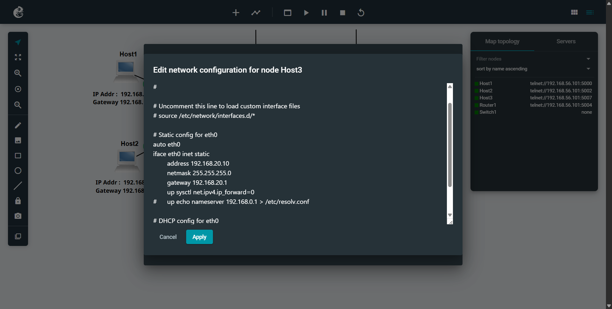
_Figure 4 – Host3 configured with IP `192.168.20.10/24`, gateway `192.168.20.1`, and forwarding disabled._

### Step 5 – Configuring Router1

Router1 requires two interface configurations — one for each subnet — and IP forwarding **must be enabled** so it can forward packets between them.

> Setting `ip_forward=1` on Router1 is critical. Without it, the router receives packets but drops them instead of forwarding them between subnets — hosts would be unreachable across networks.

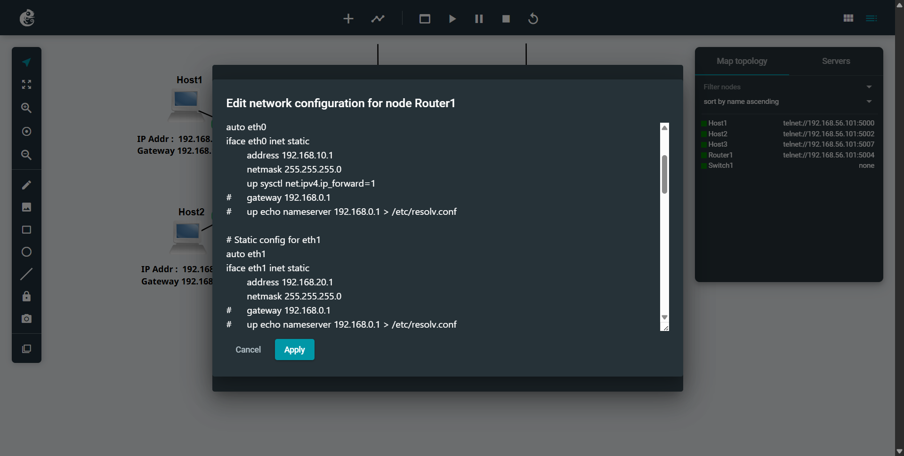
_Figure 5 – Router1 configured with eth0 (`192.168.10.1/24`) facing Network 1 and eth1 (`192.168.20.1/24`) facing Network 2, with IP forwarding enabled._

### Step 6 – Viewing Routing Tables

After starting all nodes, I opened the Web Console on each device and ran:

```bash
ip route show
```

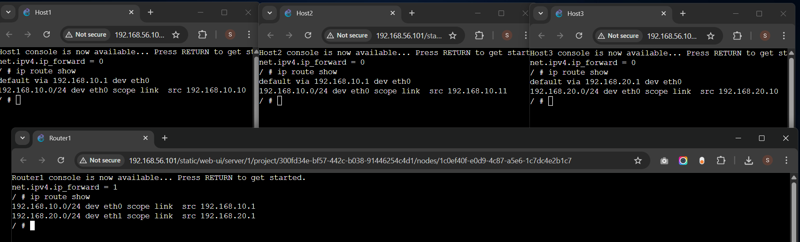
_Figure 6 – Routing tables for Host1, Host2, Host3 and Router1 shown alongside their forwarding status._

Router1 has direct routes to **both subnets** — no default gateway needed since it is physically connected to both networks. `net.ipv4.ip_forward = 1` confirms forwarding is active.

### Step 7 – Testing Cross-Subnet Connectivity with Ping

```bash
ping 192.168.20.10
```

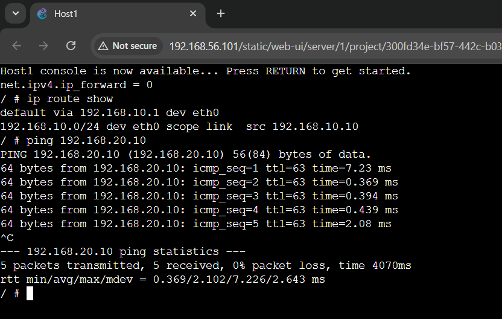
_Figure 7 – Host1 successfully pings Host3 (`192.168.20.10`) across subnets via Router1. 5 packets, 0% packet loss._

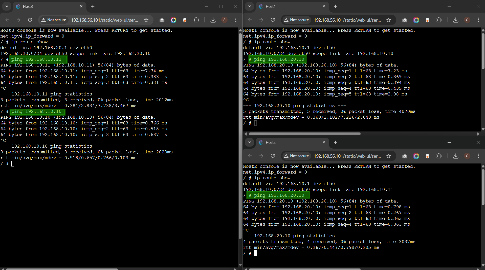
_Figure 8 – Cross-subnet ping results from all hosts: Host3 pinging Host1 and Host2, and Host2 pinging Host3 — all successful with 0% packet loss. TTL=63 on all results confirms exactly one router hop._

| Source | Destination             | Packets | Loss | Avg RTT  | TTL |
| ------ | ----------------------- | ------- | ---- | -------- | --- |
| Host1  | Host3 (`192.168.20.10`) | 5/5     | 0%   | 2.102 ms | 63  |
| Host2  | Host3 (`192.168.20.10`) | 4/4     | 0%   | 0.447 ms | 63  |
| Host3  | Host1 (`192.168.10.10`) | 3/3     | 0%   | 0.657 ms | 63  |
| Host3  | Host2 (`192.168.10.11`) | 3/3     | 0%   | 2.834 ms | 63  |

> 💡 **TTL = 63** (not 64) confirms packets passed through exactly **one router hop** — Router1 decremented the TTL by 1, providing direct evidence that routing is working correctly.

> [!NOTE]
> **📁 Source Files – Week 04 Task 1**
>
> - **Exported GNS3 Project:** [Click here to view →](./files/week04/04-View-Routes-12316923.gns3project)

---

## Task 2 – Dynamic Routing with OSPF

### Background

**OSPF (Open Shortest Path First)** is a dynamic routing protocol. Unlike the static routing in Task 1, OSPF routers automatically discover each other, exchange network topology information, and build their own routing tables — without any manual route configuration. If a link fails, OSPF automatically recalculates routes and reroutes traffic through an alternative path.

The template project uses **FRRouting (FRR)** — an open-source software router that supports OSPF and runs on Linux nodes in GNS3.

### Step 1 – Network Topology

I imported the `OSPF-Basics-Template.gns3project` and saved it as `OSPF-Basics-12316923.gns3project`. After starting all nodes and waiting for the FRR routers to boot (until the `frr#` prompt appeared), the topology showed two parallel paths between Host1 and Host2.

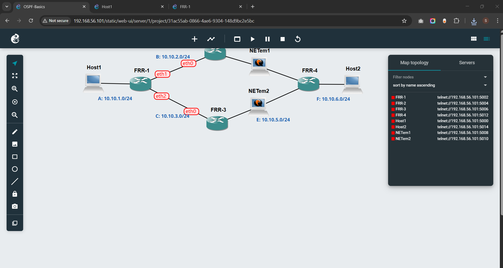
_Figure 9 – The OSPF network topology: Host1 and Host2 connected via four FRR routers with two parallel paths — top path via FRR-2 and NETem1, bottom path via FRR-3 and NETem2._

There are **two paths** between Host1 and Host2:

| Path            | Route                                          |
| --------------- | ---------------------------------------------- |
| **Top path**    | Host1 → FRR-1 → FRR-2 → NETem1 → FRR-4 → Host2 |
| **Bottom path** | Host1 → FRR-1 → FRR-3 → NETem2 → FRR-4 → Host2 |

### Step 2 – Viewing OSPF Information on FRR-1

I opened the FRR-1 console and ran three commands to view OSPF and routing information:

```bash
show ip ospf route
show ip ospf neighbor
show ip route
```

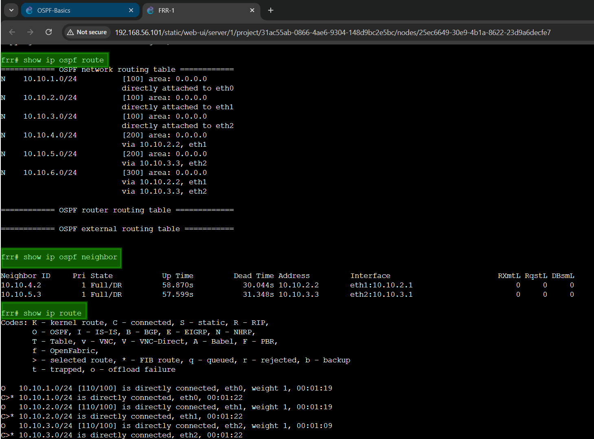
_Figure 10 – FRR-1 console showing OSPF route table, neighbour adjacencies (both FRR-2 and FRR-3 in `Full/DR` state), and the full IP routing table._

### Step 3 – Traceroute Before Link Failure

I opened the Host1 console and ran:

```bash
traceroute 10.10.6.0
```

OSPF chose the **top path** via FRR-2. The packet traversed **3 router hops** to reach FRR-4 which connects to Host2.

**Path taken:** Host1 → FRR-1 (`10.10.1.1`) → FRR-2 (`10.10.2.2`) → FRR-4 (`10.10.4.4`) → Host2

### Step 4 – Simulating a Link Failure (NETem1 Stopped)

To simulate a link failure on the active path, I stopped **NETem1** — the emulator node sitting between FRR-2 and FRR-4. This disconnected the top path.

I waited a few seconds for OSPF to detect the failure via lost Hello packets and recalculate routes, then ran `traceroute` again:

```bash
traceroute 10.10.6.0
```

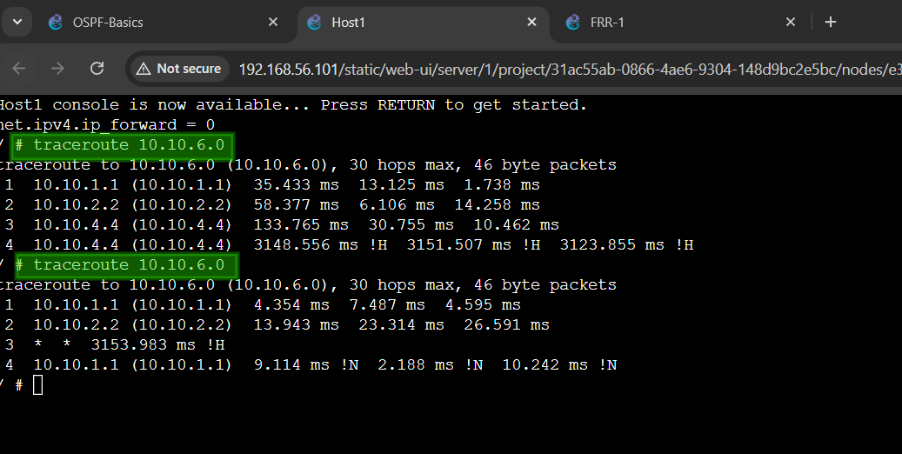
_Figure 11 – Traceroute from Host1 to `10.10.6.0` before (top) and after (bottom) stopping NETem1. After the failure, hop 3 shows `* * *` — the top path is broken and OSPF is rerouting via the bottom path through FRR-3._

|               | Before Link Failure | After Link Failure    |
| ------------- | ------------------- | --------------------- |
| **Hop 1**     | FRR-1 (`10.10.1.1`) | FRR-1 (`10.10.1.1`)   |
| **Hop 2**     | FRR-2 (`10.10.2.2`) | FRR-2 (`10.10.2.2`)   |
| **Hop 3**     | FRR-4 (`10.10.4.4`) | `* * *` — link broken |
| **Path used** | Top path via FRR-2  | Rerouting via FRR-3   |

The `* * *` at hop 3 indicates NETem1 was down and no response could be returned. The `!H` and `!N` flags signal the destination was temporarily unreachable while OSPF converged to the new path.

> [!NOTE]
> **📁 Source Files – Week 04 Task 2**
>
> - **Exported GNS3 Project:** [Click here to view →](./files/week04/OSPF-Basics.gns3project)

---

## Reflection

**Task 1** and **Task 2** together gave me a complete picture of how routing works — first with static routes manually configured, and then with OSPF dynamically managing everything.

**On static routing (Task 1):** The key insight is that hosts on different subnets cannot communicate without a router. A switch only operates at Layer 2 and cannot forward packets between subnets. When Host1 on `192.168.10.0/24` sends a packet to Host3 on `192.168.20.0/24`, it checks its routing table, sees no local route for that subnet, and forwards the packet to its default gateway — Router1. Router1 then looks up `192.168.20.0/24` in its own table, finds it is directly connected on eth1, and delivers it to Host3. The TTL of 63 (not 64) in all ping results was direct evidence of exactly one router hop — each transit through Router1 decrements TTL by 1.

**On IP forwarding:** The `net.ipv4.ip_forward` setting was critical this week. By default Linux does not forward packets between interfaces. Setting `ip_forward=1` on Router1 turns it into a functioning router. Setting `ip_forward=0` on all hosts ensures they behave as end devices and do not accidentally route traffic. This separation of roles — host versus router — is fundamental to all network design.

**On OSPF neighbour discovery (Task 2):** Seeing `Full/DR` state for both FRR-2 and FRR-3 in FRR-1's neighbour table confirmed OSPF had fully established adjacencies. The DR (Designated Router) election is an OSPF optimisation to reduce unnecessary routing traffic on a shared network segment. Understanding the state progression from Init → Two-Way → Full shows how OSPF builds trust between routers before exchanging topology information.

**On dynamic failover:** The most powerful demonstration this week was watching OSPF respond to the link failure in real time. When NETem1 was stopped, the top path through FRR-2 became unavailable. OSPF detected this through the loss of Hello packets and recalculated routes to use the bottom path through FRR-3. The second traceroute captured this transition — hop 3 showed `* * *` because the old path was broken and convergence was still in progress. This is exactly why dynamic routing protocols are essential in real enterprise networks where reliability and redundancy cannot depend on manual intervention.

**Static vs dynamic:** In Task 1, if Router1 had failed, all cross-subnet traffic would have stopped permanently with no alternative. In Task 2, OSPF automatically detected the failure and rerouted within seconds. This difference defines why OSPF and similar protocols power the internet.
