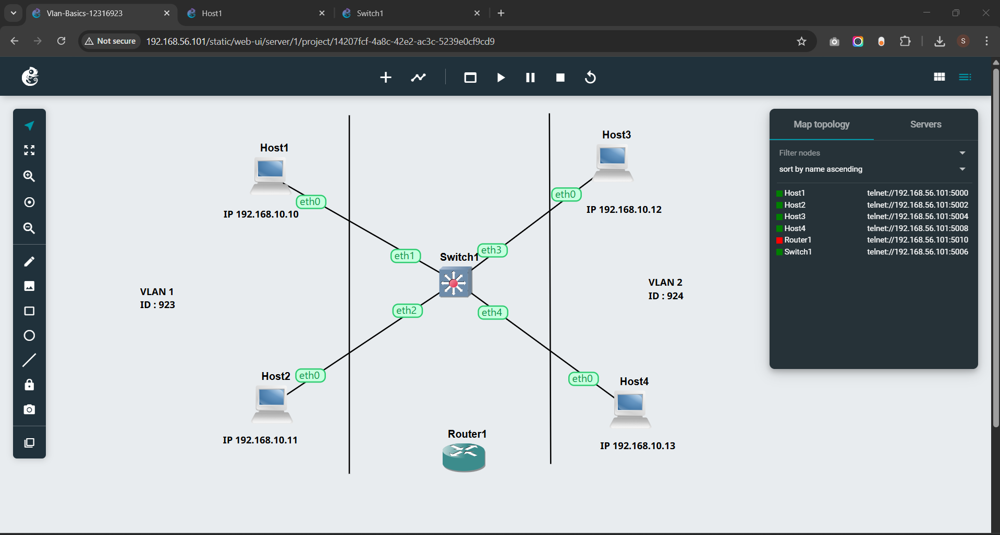
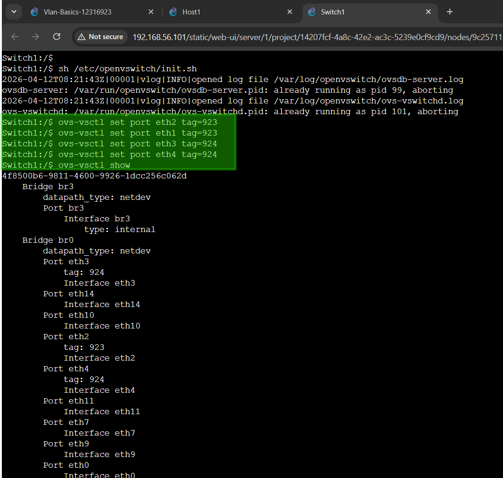
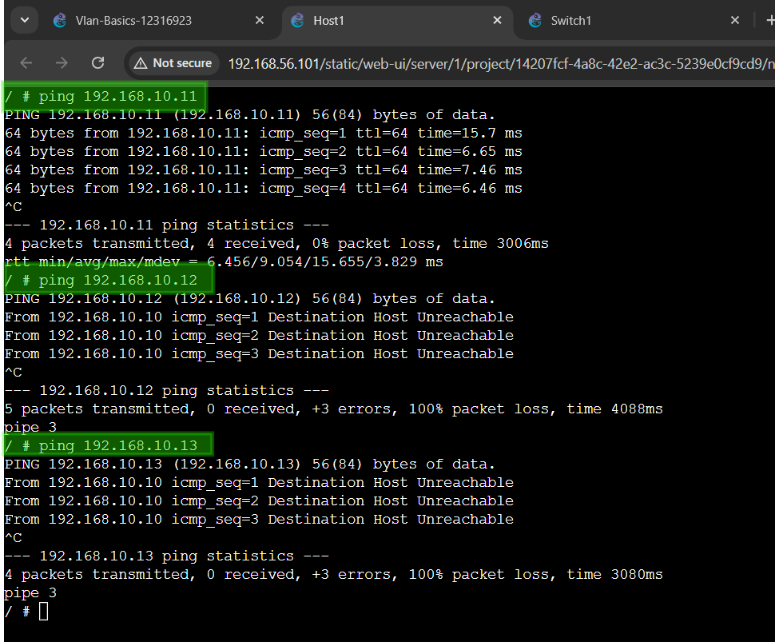
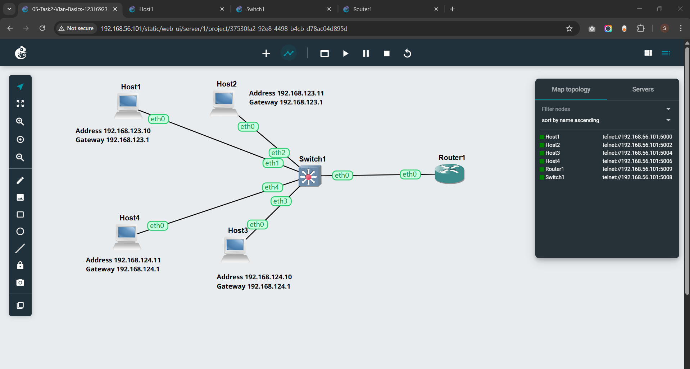
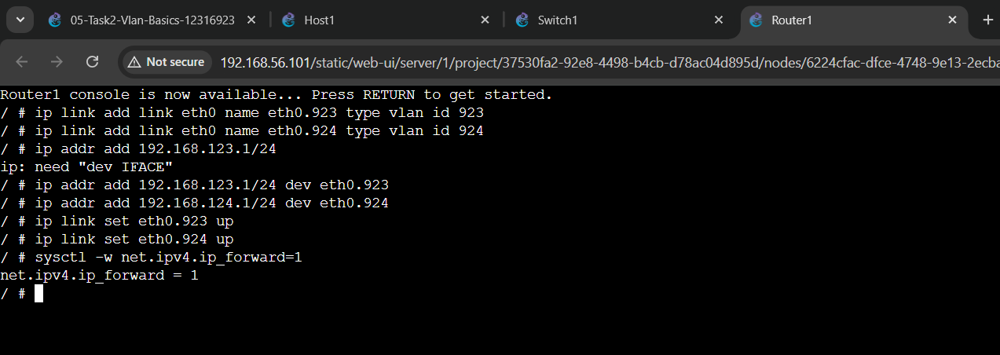
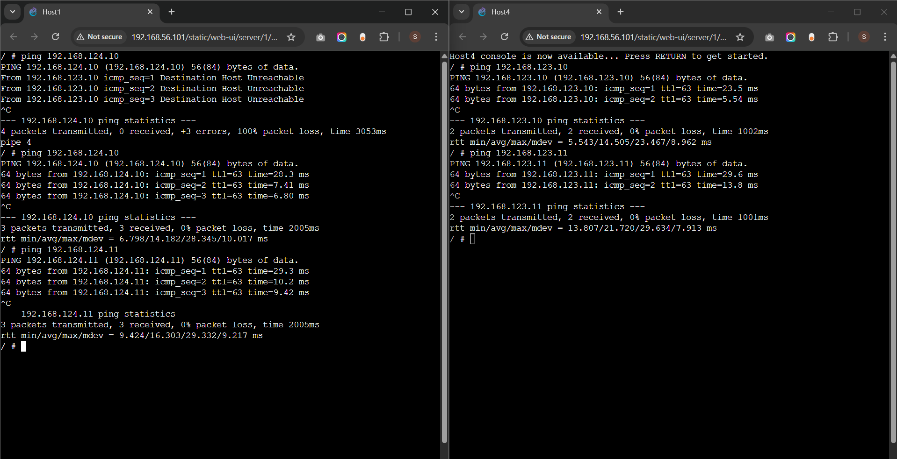

# COIT20261 – Network Routing and Switching

## Week 05 Tutorial Submission: Setup VLANs on Switch & Router

| Field            | Details                                             |
| ---------------- | --------------------------------------------------- |
| **Unit Code**    | COIT20261 – Network Routing and Switching           |
| **Tutorial**     | Week 05 — VLANs on OpenvSwitch & Inter-VLAN Routing |
| **Student ID**   | 12316923                                            |
| **Student Name** | Sunil B K                                           |
| **Date**         | Week 05                                             |

> **Objective:** This week covered two tasks. Task 1 configured VLANs on an OpenvSwitch to segment four hosts into two isolated groups. Task 2 extended the topology by adding a Linux Router to enable inter-VLAN routing — allowing hosts on different VLANs to communicate through the router's VLAN sub-interfaces.

---

## Task 1 – Setup VLANs on Switch

### Task Overview

I created project `Vlan-Basics-12316923` with four Linux hosts and one OpenvSwitch. **VLAN IDs** are based on the last three digits of my Student ID (`12316923`) → **923** and **924**.

| Host  | IP Address      | Switch Port | VLAN ID | Group  |
| ----- | --------------- | ----------- | ------- | ------ |
| Host1 | `192.168.10.10` | eth1        | **923** | VLAN 1 |
| Host2 | `192.168.10.11` | eth2        | **923** | VLAN 1 |
| Host3 | `192.168.10.12` | eth3        | **924** | VLAN 2 |
| Host4 | `192.168.10.13` | eth4        | **924** | VLAN 2 |

### Step 1 – Network Topology

I added 4 Linux Host nodes and 1 OpenvSwitch, connecting each host starting from eth1 (leaving eth0 free for Task 2):

- Host1 → Switch1 **eth1**
- Host2 → Switch1 **eth2**
- Host3 → Switch1 **eth3**
- Host4 → Switch1 **eth4**


_Figure 1 – Network topology: Host1 and Host2 in VLAN 1 (ID: 923), Host3 and Host4 in VLAN 2 (ID: 924). All four hosts connect to Switch1 via ports eth1–eth4. Router1 is visible but not yet connected — used in Task 2._

### Step 2 – Initialising OpenvSwitch and Applying VLAN Tags

I opened the Switch1 Web Console, ran the init script, then applied the VLAN access port tags:

```bash
sh /etc/openvswitch/init.sh

ovs-vsctl set port eth1 tag=923
ovs-vsctl set port eth2 tag=923
ovs-vsctl set port eth3 tag=924
ovs-vsctl set port eth4 tag=924

ovs-vsctl show
```

The `ovs-vsctl show` output confirmed:

- **eth1** → `tag: 923`
- **eth2** → `tag: 923`
- **eth3** → `tag: 924`
- **eth4** → `tag: 924`


_Figure 2 – Switch1 console showing VLAN tag commands applied (highlighted green) and `ovs-vsctl show` confirming eth1/eth2 tagged as VLAN 923 and eth3/eth4 tagged as VLAN 924._

### Step 3 – Testing VLAN Isolation with Ping

From **Host1**, I tested connectivity to all other hosts:

```bash
ping 192.168.10.11   # Host2 — same VLAN 923
ping 192.168.10.12   # Host3 — different VLAN 924
ping 192.168.10.13   # Host4 — different VLAN 924
```

**Results:**

```
ping 192.168.10.11 → 4/4 received, 0% loss, avg 9.054 ms   ✅ VLAN 923 → VLAN 923
ping 192.168.10.12 → 0/5 received, 100% loss — Destination Host Unreachable  ❌
ping 192.168.10.13 → 0/4 received, 100% loss — Destination Host Unreachable  ❌
```


_Figure 3 – Host1 console: successful ping to Host2 (same VLAN 923, 0% loss), and blocked pings to Host3 and Host4 (VLAN 924, 100% loss — "Destination Host Unreachable"). VLAN isolation confirmed._

---

## Task 2 – Setup VLANs on a Router (Inter-VLAN Routing)

### Task Overview

I copied the project to `05-Task2-Vlan-Basics-12316923` and added a **Linux Router** connected to Switch1's **eth0** port. The two VLANs were given **separate IP subnets** so the router could forward traffic between them.

### Step 1 – Network Topology

I added **Router1** to the project and connected it to **Switch1 eth0**, which would be configured as a trunk port carrying both VLANs.


_Figure 4 – Task 2 topology: Host1 and Host2 on subnet `192.168.123.0/24` (VLAN 923), Host3 and Host4 on subnet `192.168.124.0/24` (VLAN 924). Router1 connects to Switch1 via eth0 and handles inter-VLAN routing through sub-interfaces._

### Step 2 – Configure Switch Trunk Port (eth0)

I opened the Switch1 console and configured **eth0 as a trunk port** allowing all VLANs to pass through to the router:

```bash
ovs-vsctl set port eth0 trunks=[]
```

Setting `trunks=[]` allows **all VLAN IDs** on the trunk port — the router will then receive tagged frames for both VLAN 923 and VLAN 924.

### Step 3 – Configure Router1 VLAN Sub-interfaces

I opened the **Router1 Web Console** and created VLAN sub-interfaces on `eth0` — one per VLAN — then assigned gateway IP addresses and enabled IP forwarding:

```bash
# Create sub-interfaces for each VLAN
ip link add link eth0 name eth0.923 type vlan id 923
ip link add link eth0 name eth0.924 type vlan id 924

# Assign gateway IP to each sub-interface
ip addr add 192.168.123.1/24 dev eth0.923
ip addr add 192.168.124.1/24 dev eth0.924

# Bring both sub-interfaces up
ip link set eth0.923 up
ip link set eth0.924 up

# Enable IP forwarding
sysctl -w net.ipv4.ip_forward=1
```

**Output confirmed:**

```
net.ipv4.ip_forward = 1
```


_Figure 5 – Router1 console showing VLAN sub-interface creation (`eth0.923`, `eth0.924`), IP address assignment, and IP forwarding enabled. `net.ipv4.ip_forward = 1` confirms the router is active._

### Step 4 – Testing Inter-VLAN Connectivity with Ping

After configuring the router sub-interfaces, I tested connectivity from **Host1** (VLAN 923) to both VLANs, and from **Host4** (VLAN 924) back to VLAN 923:


_Figure 6 – Host1 (left): first ping to `192.168.124.10` fails before router config, then succeeds with TTL=63 after router sub-interfaces are up. Host4 (right): successfully pings both `192.168.123.10` and `192.168.123.11` with TTL=63 — confirming full inter-VLAN routing._

> [!NOTE]
> **📁 Source Files – Week 05 Task 2**
>
> - **Exported GNS3 Project:** [Click here to view →](./files/week05/05-Task2-Vlan-Basics-12316923.gns3project)

---

## Reflection

This week built on the VLAN concept from Task 1 by adding a router — transforming an isolated VLAN setup into a fully routed inter-VLAN network.

**On Task 1 (VLAN isolation):** The power of VLANs is that isolation works entirely at Layer 2, even when all hosts are on the same physical switch and share the same IP subnet. The switch simply drops any frame tagged for a different VLAN before it reaches the destination port. The "Destination Host Unreachable" error shows that the switch blocked even the ARP broadcast from crossing VLAN boundaries — Host1 could not discover the MAC address of Host3 because the ARP packet never reached VLAN 924 ports.

**On Task 2 (inter-VLAN routing):** This task introduced the concept of **router-on-a-stick** — a routing architecture where a single physical link between switch and router carries multiple VLANs via a trunk port, and the router uses VLAN sub-interfaces (`eth0.923`, `eth0.924`) to handle each VLAN as a separate logical interface with its own IP address. This is the gateway IP that hosts in each VLAN use as their default route.

The key insight is that the router sees VLAN 923 traffic on `eth0.923` and VLAN 924 traffic on `eth0.924` — even though both arrive on the same physical cable. The VLAN tag in the Ethernet frame tells the router which sub-interface to process the packet on. When Host1 wants to reach Host4, it sends the packet to its gateway (`192.168.123.1` on `eth0.923`), the router strips the VLAN 923 tag, re-tags it as VLAN 924, and forwards it out the same physical interface back to the switch — which delivers it to the VLAN 924 hosts.

**On the failed first ping:** The "Destination Host Unreachable" before router configuration was important. Even though the hosts had correct gateway settings, the router sub-interfaces did not exist yet — so the gateway IP was unreachable and Host1's packets had nowhere to go. This reinforced that all layers must be configured correctly before end-to-end traffic can flow.
