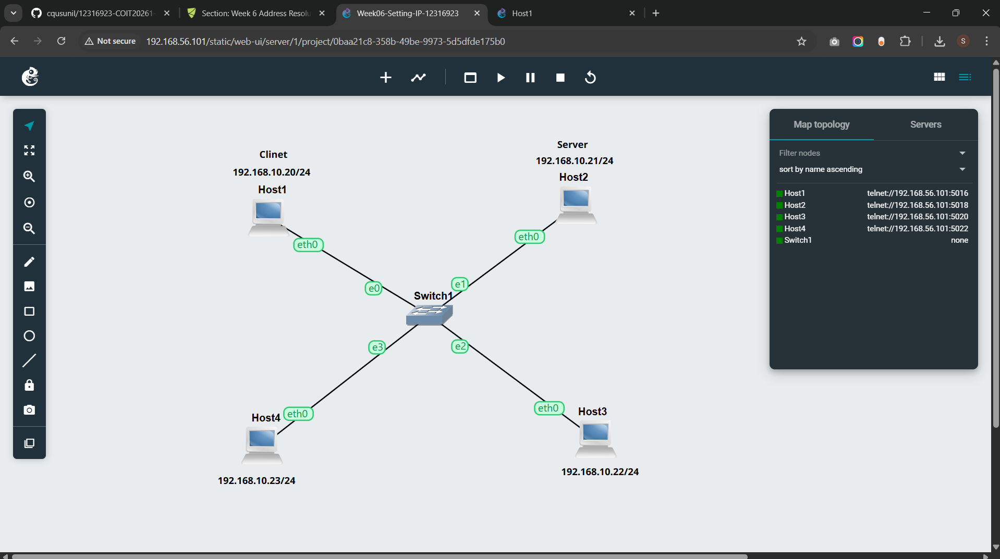
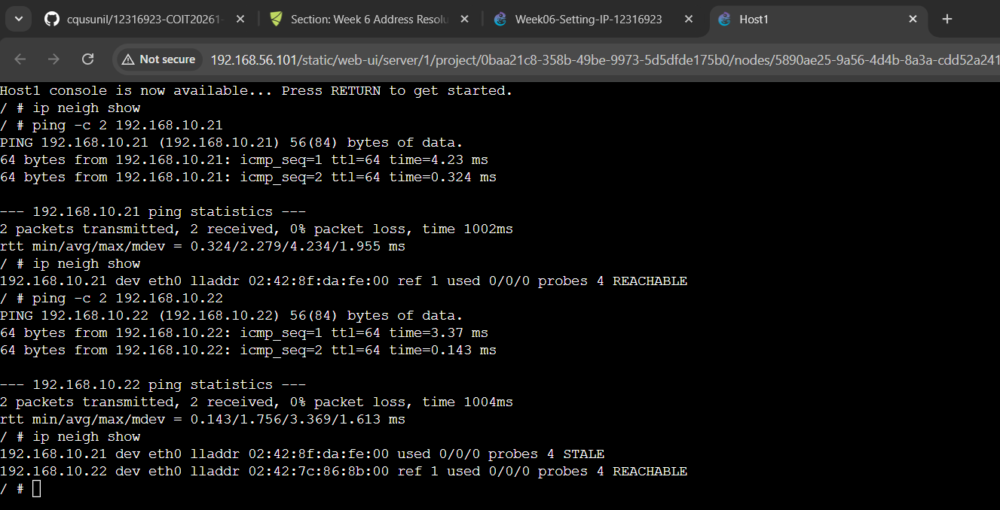
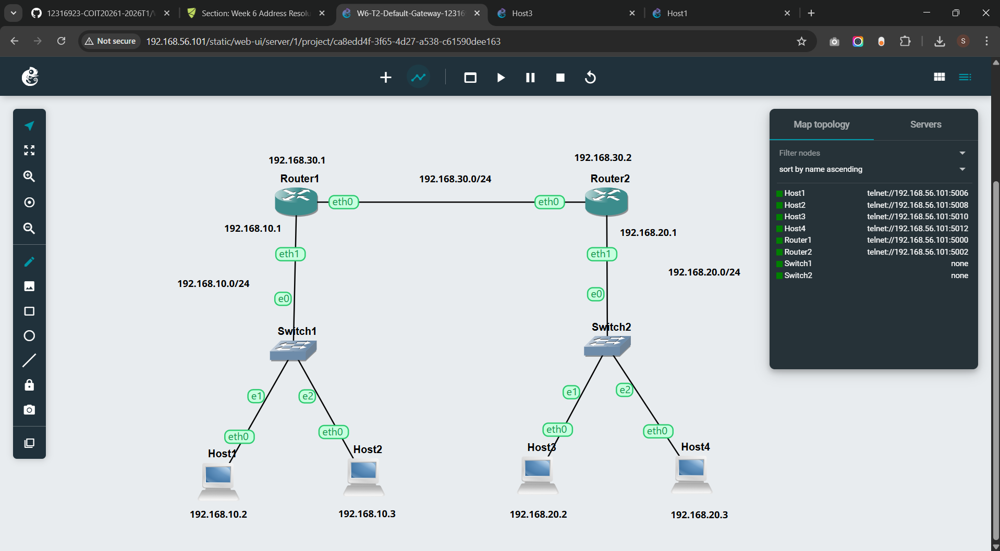
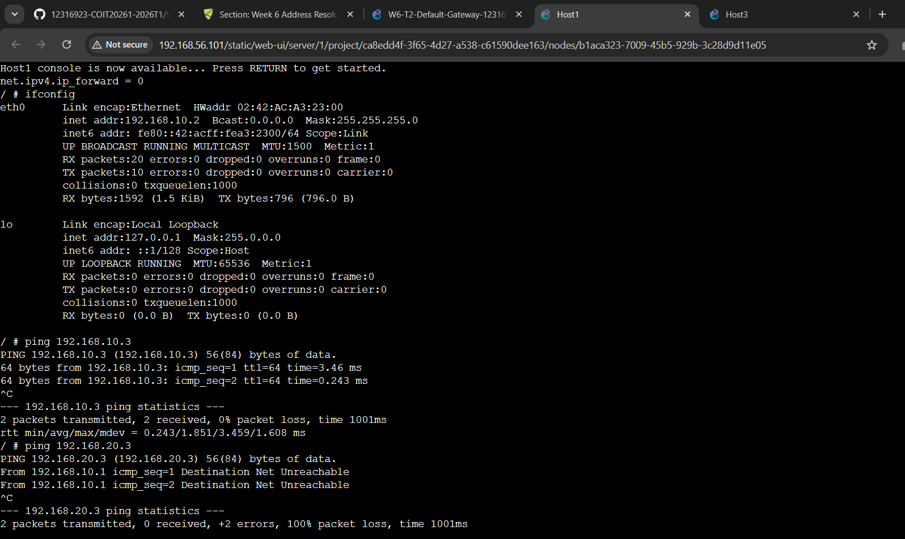
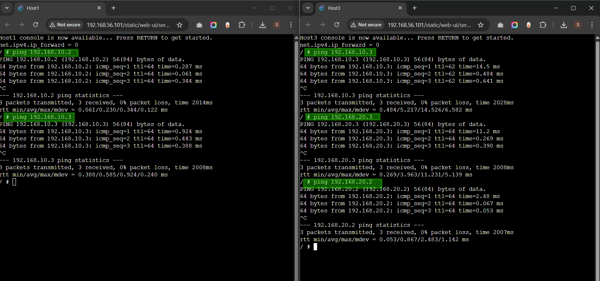

# COIT20261 – Network Routing and Switching

## Week 06 Tutorial Submission: ARP & Default Gateways

| Field            | Details                                                      |
| ---------------- | ------------------------------------------------------------ |
| **Unit Code**    | COIT20261 – Network Routing and Switching                    |
| **Tutorial**     | Week 06 — Resolving IP Addresses with ARP & Default Gateways |
| **Student ID**   | 12316923                                                     |
| **Student Name** | Sunil B K                                                    |
| **Date**         | Week 06                                                      |

> **Objective:** This week covered two tasks. Task 1 explored how ARP (Address Resolution Protocol) maps IP addresses to hardware (MAC) addresses and how the ARP table changes over time as devices communicate. Task 2 built a three-subnet network with two routers and configured default gateways to enable full cross-subnet routing.

---

## Task 1 – Resolving IP Addresses to Hardware Addresses (ARP)

### Task Overview

I reused the `week06-Setting-IP-12316923` project which contains four Linux hosts on the same subnet connected through Switch1.

| Host           | IP Address         |
| -------------- | ------------------ |
| Host1 (Host A) | `192.168.10.20/24` |
| Host2 (Host B) | `192.168.10.21/24` |
| Host3 (Host C) | `192.168.10.22/24` |
| Host4 (Host D) | `192.168.10.23/24` |


_Figure 1 – The Week 06 Task 1 network: Host1 (Client, `192.168.10.20/24`) and Host2 (Server, `192.168.10.21/24`) used as Host A and B. All four hosts share the `192.168.10.0/24` subnet via Switch1._

### Step 1 – View ARP Table Before Any Ping (Empty State)

I opened the **Host1 Web Console** and ran:

```bash
ip neigh show
```

The command returned **no output** — the ARP table was completely empty because Host1 had not yet communicated with any other device. At this point, Host1 knows its own IP and MAC but has no record of any neighbours.

### Step 3 – Ping Host3, Then View ARP Table Again

I sent 2 ping packets from Host1 to Host3:

```bash
ping -c 2 192.168.10.22
```

I then viewed the ARP table again:

```bash
ip neigh show
```

**Output:**


_Figure 2 – Host1's ARP table progression: initially empty, then Host2 added as REACHABLE after ping, then Host3 added as REACHABLE while Host2 transitions to STALE after time passes without communication._

> [!NOTE]
> **📁 Source Files – Week 06**
>
> - **Exported GNS3 Project (Task 2):** [Click here to view →](./files/week06/week06-Setting-IP-12316923.gns3project)

---

## Task 2 – Default Gateways

### Task Overview

I created a new project named `Default-Gateway-12316923` with a three-subnet topology using two routers.

### Step 1 – Network Topology

I built the topology with:

- **Host1** and **Host2** → **Switch1** → **Router1 eth1** (Subnet 1)
- **Host3** and **Host4** → **Switch2** → **Router2 eth1** (Subnet 2)
- **Router1 eth0** ↔ **Router2 eth0** directly connected (Subnet 3)


_Figure 3 – The Default Gateway topology: Subnet 1 (`192.168.10.0/24`) on the left with Router1, Subnet 2 (`192.168.20.0/24`) on the right with Router2, and Subnet 3 (`192.168.30.0/24`) connecting both routers directly._

### Step 2 – Ping Error Before Full Gateway Configuration

Before the routers had their gateways correctly configured to forward between subnets, I tested connectivity from Host1:

```bash
ping 192.168.10.3       # Same subnet — Host2
ping 192.168.20.3       # Different subnet — Host4
```

**Output:**

```
PING 192.168.10.3 → 2/2 received, 0% loss         ✅ Same subnet works
PING 192.168.20.3 → Destination Net Unreachable   ❌ Cross-subnet fails
```

The error **"Destination Net Unreachable"** came from `192.168.10.1` (Router1) — meaning Router1 received the packet but had no route to `192.168.20.0/24` and sent back an ICMP unreachable message. This confirmed the routers needed gateway entries pointing to each other via Subnet 3.


_Figure 4 – Host1 console: ping to Host2 (same subnet `192.168.10.3`) succeeds, but ping to Host4 (`192.168.20.3`) returns "Destination Net Unreachable" from Router1 (`192.168.10.1`) — the routers were not yet configured to forward between subnets._

### Step 3 – Configuring Router Gateways

To allow Router1 to reach Subnet 2 and Router2 to reach Subnet 1, each router needs a default gateway pointing to the other via Subnet 3.

**Configure for Router 1**

```
# Static config for eth0
auto eth0
iface eth0 inet static
	address 192.168.30.1
	netmask 255.255.255.0
    up sysctl net.ipv4.ip_forward=1
	gateway 192.168.30.2
#	up echo nameserver 192.168.0.1 > /etc/resolv.conf
```

**Configure for Router 2**

```
# Static config for eth0
auto eth0
iface eth0 inet static
	address 192.168.30.2
	netmask 255.255.255.0
    up sysctl net.ipv4.ip_forward=1
	gateway 192.168.30.1
#	up echo nameserver 192.168.0.1 > /etc/resolv.conf
```

### Step 4 – Testing Full Cross-Subnet Connectivity

After configuring both routers with correct gateways, I tested ping from multiple hosts:


_Figure 5 – Host1 (left) successfully pings Host2 within Subnet 1. Host3 (right) successfully pings Host2 (`192.168.10.3`) across subnets with TTL=62, and pings within Subnet 2 (Host3, Host4) with TTL=64._

> [!NOTE]
> **📁 Source Files – Week 06**
>
> - **Exported GNS3 Project (Task 2):** [Click here to view →](./files/week06/W6-T2-Default-Gateway-12316923.gns3project)

## Reflection

This week covered two fundamental networking concepts — ARP and default gateways — that together explain how IP communication actually works at the hardware level and across multiple networks.

**On ARP (Task 1):** The ARP table starting empty and then filling up as I pinged each host made the protocol's purpose very clear. Before any communication, Host1 had no idea about the MAC addresses of its neighbours. When I ran the first ping to Host2, the OS automatically sent an ARP broadcast — "Who has `192.168.10.21`? Tell `192.168.10.20`" — and Host2 replied with its MAC address. That exchange is what created the REACHABLE entry in the table. The transition from REACHABLE to STALE for Host2 after I pinged Host3 shows that ARP entries are time-limited — the OS marks them STALE when not recently confirmed, and will re-verify via ARP the next time traffic is sent. This prevents the table from holding outdated mappings forever if a device changes its MAC address (e.g. after a NIC replacement).

**On Default Gateways (Task 2):** The ping error before full configuration was the most instructive moment. The "Destination Net Unreachable" message came from Router1 — not from the destination host. This means Router1 received the packet from Host1 but had no route to `192.168.20.0/24` in its table. Once I added a default gateway on Router1 pointing to Router2 (`192.168.30.2`), and vice versa, the routers could forward packets to each other through Subnet 3 — the inter-router link. This three-subnet design with a dedicated router-to-router subnet (`192.168.30.0/24`) reflects a real-world pattern used in enterprise and ISP networks, where routers are interconnected via point-to-point links separate from the host-facing subnets.

**On TTL as a diagnostic tool:** The TTL=62 on cross-subnet pings was a valuable observation. TTL=64 means same-subnet (no router hops). TTL=63 means one hop (Week 04). TTL=62 means two hops — exactly what we expect when packets travel Host3 → Router2 → Router1 → Host2. This pattern is a reliable way to count router hops without running `traceroute`.
